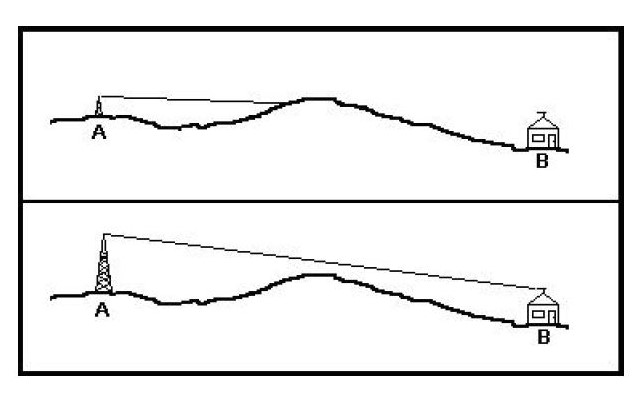

# Anatomy of a flight

Before you begin planning a flight it's important to understand what's involved, below is an overview of what happens during a balloon flight.

## Overview
A High Altitude Balloon flight involves sending a lightweight payload into the upper stratosphere (which isn't space) attached to a weather balloon. The chart shows a fairly typical flight profile, rising steadily (about 5m/s) to a height of 31km and then descending fairly rapidly (average or 12m/s).

- The balloon, filled with either Hydrogen or Helium, generates the lift required to [reach the upper atmosphere](https://www.youtube.com/watch?v=_CPRcW4IwS0)
- At the apex of the flight, the balloon, fully expanded due to decreased air pressure, will [burst](https://www.youtube.com/watch?v=PfD309zhKi0) leaving the payload to fall back down to earth.
- During the descent, the payload is slowed by a parachute which is between the payload and the balloon
- The goal is to successfully launch the balloon and be at (or near) the landing site when the balloon comes down

## Permission to launch

Launching your own near space mission involves sending an object through local airspace and transmitting radio signals. Both these activities are likely to be restricted and you will need to seek or check permissions
- In the UK the airspace in controlled by the Civil Aviation Authority and they must grant you permission before you launch. In other parts of the world you will need to find out who controls the airspace and can issue permission.
- Different countries around the world have different rules about transmitting radio data. In the UK we are limited to a frequency range and power for our transmissions. In the USA you need to be a licensed radio operator in order to transmit.
- Choosing a launch location can be tricky, but you should ensure you have the consent of the landowner to launch from their site.

## Flight Predictions

Finding a good launch window can be tricky, the animation below shows a predicted flight path of a balloon at the same time of day for seven consecutive days.

Once you release you balloon flight you will have no control over where it ends up. Luckily there are some great tools available to help you predict the flight path.
There are a number of variables which determine the path the balloon takes, some you can change to effect the flight and others that you have no control over.
- The weather is something beyond your control and depending of where you are launching from it could be more or less predictable. In the UK the weather can vary hugely from day to day which presents an interesting challenge.
- Even in tricky conditions you many be able to impact of the predicted flight path by changing one of the following, for example changing the ascent and decent rates can shorten or lengthen the flight path of the balloon. This can be achieved by adjusting
  - size of the balloon used
  - amount of lifting gas
  - size of the parachute
  - mass of the payload
- If all else fails you may have to consider changing your launch time or even launch location.

## Tracking the flight

1. During the flight, the payload receives GPS data from satellites overhead
1. It then combines its location with some other data including time, temperature and a timestamp to create a sentence
1. This sentence is then transmitted using a radio transmission down towards receivers on the ground
1. The team launching the payload receives the data and uses this to follow the balloon
1. Other HAB enthusiasts can also receive the signal if they have similar tracking equipment
1. Anyone receiving the transmissions can upload their data to the [habhub.org](habhub.org) website. Uploaded data can be seen in the [site log](habitat.habhub.org/logtail)
1. The website collates all data and uses it to plot the payload position on a [map](tracker.habhub.org)
1. Using this distributed tracking system means that the flight isn’t dependent on a single person receiving and makes it much more likely that a flight can be tracked and recovered.

## Some radio theory

- Radio waves travel in straight lines and need line of sight for the signal to be received
- At low altitudes the payload has a small range, however the higher it goes the larger the range becomes
- This means that at low altitude very few people will be in range (only those beneath the payload) whilst at high altitude there could a large number of people picking up the signal.

- At ground level, local obstacles can cause a problem. If there is no line of sight then the signal will not be received

- The chart above shows a typical flight’s change in altitude over time, the red areas (when the payload is close to the ground) are crucial.
- At a height of less than 500 meters, it is unlikely that any other community receivers will be able to receive and decode data from a payload
- The aim of the launch team is to get someone to the likely landing site for the payload in order to receive the signal as it comes down and ultimately get it’s final position on the ground.

## Getting involved
If you've never been involved in a high altitude balloon flight there are some simple ways to get started.

### Participate in a High Altitude Balloon Launch

A great way to find out what’s involved in a High Altitude Balloon flight is to take part. While no part of a flight is hugely complicated, there are many aspects to manage at once. Taking part can help make these aspects clearer without having to plan and run your own launch. To take part you could:
  - Visit the [Habhub](http://habitat.habhub.org/) website which maintains a [calendar](http://habitat.habhub.org/calendar/) of upcoming launches, if there's one local to you contact the organiser and see if you can help.
  - Follow the [#ukhas](https://twitter.com/hashtag/ukhas) hashtag to talk to other balloon enthusiasts and find out where and when they are launching.

### Follow flights online

There are frequent launches taking place all over the world and many of them track their progress through the tracking website [tracker.habhub.org](https://tracker.habhub.org) (shown below). Their tools allow you to look for upcoming launches and follow active flights.

### Viewing transmitted images

Many payloads also collect and transmit images back down to earth during their flight. The pictures are received and uploaded to a separate site, [ssdv.habhub.org](https://ssdv.habhub.org). They appear in the order they are received, newest first, and are tagged using the payload’s name.

### Exploring Flight Data

During a flight, a balloon’s payload also tracks its position and time, plus a whole load of sensor data that you can download and manipulate into visual forms such as graphs, map plots or even flight path animations. To access this data you can visit [http://habitat.habhub.org/ept/](http://habitat.habhub.org/ept/). Enter the name of the flight and payload you want data for, choose the data you want to download, and select CSV, JSON or KML.

- **CSV** files can be imported into a spreadsheet program to analyse and create charts showing changes during the flight. Here’s one showing temperature changes over time.

  

- **KML** files can be used by [Google Maps](https://www.google.com/maps/d/?hl=en&authuser=0&action=open)/Google Earth to create 2D and 3D paths and even turned into animations.

  

### Flight Tracking

During most flights, the launch team are reliant on the wider Ballooning community to help them track their payload whilst in flight. A great way of supporting a flight is to track the payload using receiver equipment and sharing the telemetry data online.

#### RTTY

Most flights transmit data using a mechanism known as Radio Teletype (RTTY). The RTTY signal needs to be converted to something audible using a radio. This audio signal then needs to be decoded using a piece of software which generates a data sentence consisting of the position of the payload plus other data.

There are a number of ways of combining different equipment together to be able to decode RTTY sentences. For more information on suitable kit and how to combine them, you can follow our detailed guides in the [testing](5-test.md) section:

#### LORA

Some payloads utilise the Long Range (LORA) network mechanism which transmits the same data as RTTY but abstracts the decoding. As long as your LORA receiver (gateway) is tuned to the correct frequency, it will receive and decode telemetry data from a payload.

The easiest way to build a LORA gateway is with a Raspberry Pi and a Lora Hat. This will cost approximately £80 and you can find instructions in the [build](4-build.md) section of this guide
