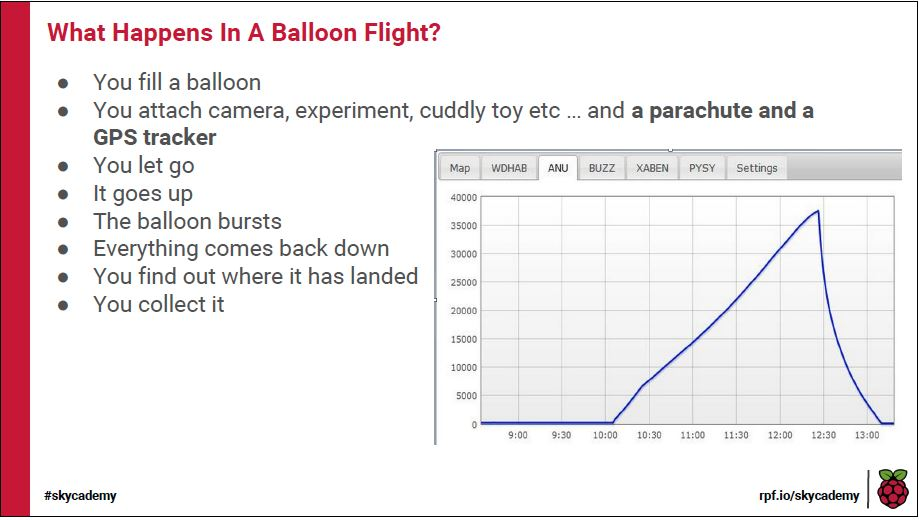
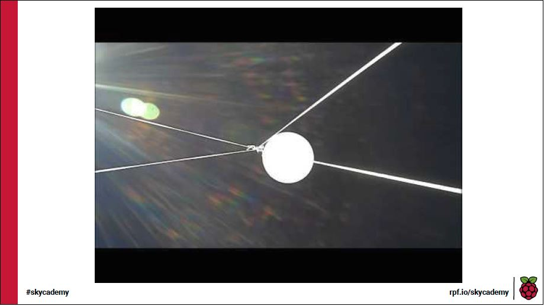

- A flight involves sending a lightweight payload into the upper atmosphere (not space) attached to a weather balloon
- The balloon, filled with either Hydrogen or Helium generates the lift required to reach the upper atmosphere
- At the apex of the flight the balloon, stretched due to decreased air pressure, will burst leaving the payload to fall back down to earth.
- During the descent the payload is slowed by a parachute which is between the payload and the balloon
- You goal is to successfully launch the balloon and be at (or near) the landing site when the balloon comes down
- The chart shows a fairly typical flight profile, rising steadily to a height of 38km and then descending fairly rapidly

- The video shows a faily ideal launch in low wind conditions with the payload chain ascending at about 5 m/s
- You can make out the balloon connected to the parachute and few metres below, further down is the box containing the payload and then right at the bottom of the line is a second tracker acting as a backup.

