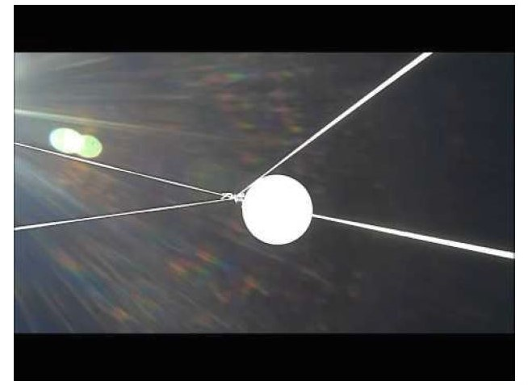

- A flight involves sending a lightweight payload into the upper atmosphere (not space) attached to a weather balloon
- The balloon, filled with either Hydrogen or Helium generates the lift required to reach the upper atmosphere
- At the apex of the flight the balloon, stretched due to decreased air pressure, will burst leaving the payload to fall back down to earth.
- During the descent the payload is slowed by a parachute which is between the payload and the balloon
- You goal is to successfully launch the balloon and be at (or near) the landing site when the balloon comes down
- The chart shows a fairly typical flight profile, rising steadily to a height of 38km and then descending fairly rapidly

- The video above shows a faily ideal launch in low wind conditions with the payload chain ascending at about 5 m/s
- You can make out the balloon connected to the parachute and few metres below, further down is the box containing the payload and then right at the bottom of the line is a second tracker acting as a backup.

- In the video above, you can see the moment of burst, as the balloon under pressure expands and reaches it’s limit
- The faint trace of the balloon after burst is the talcum powder that the balloon is covered in to prevent it sticking to itself

###Preparation

There are number of steps needed in order to prepare for a launch, each are relatively straightforward, however all need to be mastered before attempting a flight:

- Decide what you want to achieve
- Decide where (away from airports, preferably with plenty of land to the east)
- Permission (from CAA and from landowner)
- Construction and setup - tracker, payload container
- Testing (especially the tracking)
- Predictions - where it’s likely to land, launch winds and weather
- Confirm permission request
- Flight announcements - get the HAB community to help
- Fill and Launch
- Chase

###Permission/NOTAM

To launch a flight you will need to have permission from your local aviation authority. **You must not launch without it.**

In the UK, flights must be approved by the Civil Aviation Authority who, if happy, will issue a Notice to Airman (NOTAM) which they will publish [here](http://notaminfo.com). Airfields and other airspace users are then aware and can take appropriate action to avoid your flight, they may contact you on the day with questions. A NOTAM may have restrictions to launch times / directions etc, these
restrictions must be observed.

###NOTAM Procedure

- Choose a suitable site
- Apply 28 days in advance
- Request multiple days
- Call to check a few days before launch
- Cancel/change dates as necessary
- Check the permission
- Check the NOTAM
- Check for restrictions
- Check if you need to call ATC

- During the the payload receives GPS data from satellites overhead
- It then combines its location with some other data including time, temperature and a timestamp to create a sentence
- This sentence is then transmitted using RTTY / LoRa or both down towards receivers on the ground
- The team launching the payload receive the data and use this to follow the balloon
- Other HAB enthusiasts use also receive the signal, provided they know about the launch
- Anyone receiving the transmissions can upload their data to the habhub.org website, uploaded data can be seen in the logtail
- The website collates all data and uses it to plot the payload position on a map
- Using this distributed tracking system means that the flight isn’t dependant on a single person receiving and makes it much more likely that a flight can be tracked and recovered.

- The slide above illustrates the restrictions involved in transmitting a radio signal from a balloon, the tiny pink section here indicates the small proportion of the UK radio spectrum which is permitted for this use
- Countries around the world have different restrictions or conditions on using radio equipment at altitude, for example in the USA you need a HAM radio license in order to transmit.
- It’s important to check the local restrictions in your country before planning your flight
