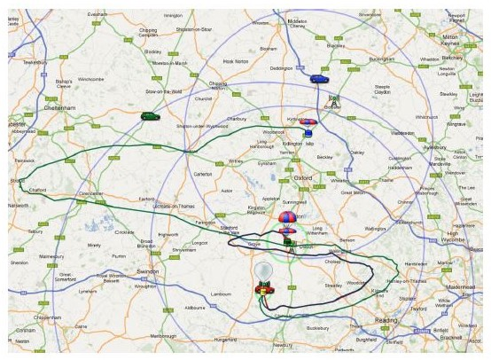
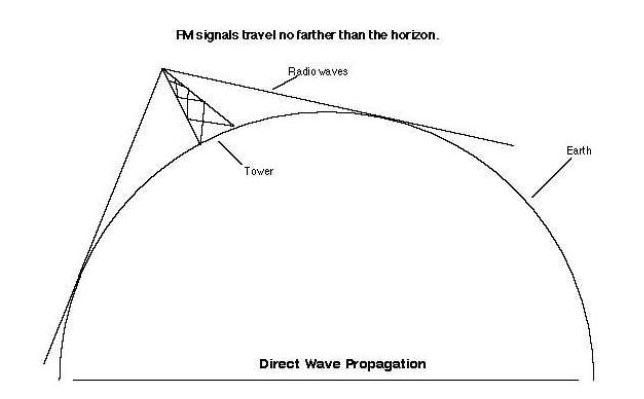
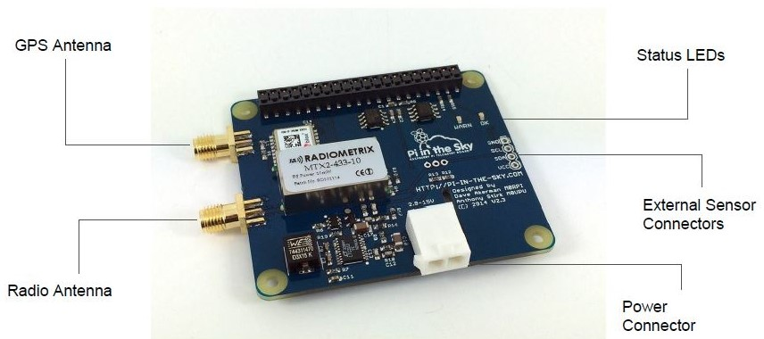

# Anatomy of a flight

Before you begin planning a flight it's important to understand what's involved, below is an overview of what happens during a balloon flight.

## Overview

- A flight involves sending a lightweight payload into the upper atmosphere (not space) attached to a weather balloon
- The balloon, filled with either Hydrogen or Helium, generates the lift required to reach the upper atmosphere
- At the apex of the flight, the balloon, fully expanded due to decreased air pressure, will burst leaving the payload to fall back down to earth.
- During the descent, the payload is slowed by a parachute which is between the payload and the balloon
- You goal is to successfully launch the balloon and be at (or near) the landing site when the balloon comes down
- The chart shows a fairly typical flight profile, rising steadily to a height of 38km and then descending fairly rapidly

## Permission to launch

## Flight Predictions

## Launch

- The video above shows a good launch in low wind conditions with the payload chain ascending at about 5 m/s
- You can make out the balloon connected to the parachute and few metres below. Further down is the box containing the payload and then right at the bottom of the line is a second tracker acting as a back up.

## Burst

- In the video above, you can see the moment of burst as the balloon expands under pressure and reaches it’s limit
- The faint trace of the balloon after burst is the talcum powder that the balloon is covered in to prevent it sticking to itself

## Tracking

- During the flight, the payload receives GPS data from satellites overhead
- It then combines its location with some other data including time, temperature and a timestamp to create a sentence
- This sentence is then transmitted using RTTY and/or LoRa down towards receivers on the ground
- The team launching the payload receives the data and uses this to follow the balloon
- Other HAB enthusiasts can also receive the signal if they have similar tracking equipment
- Anyone receiving the transmissions can upload their data to the habhub.org website. Uploaded data can be seen in the logtail
- The website collates all data and uses it to plot the payload position on a map
- Using this distributed tracking system means that the flight isn’t dependant on a single person receiving and makes it much more likely that a flight can be tracked and recovered.

###Preparation

There are a number of steps needed in order to prepare for a launch. Each are relatively straightforward but all need to be mastered before attempting a flight:

- Decide what you want to achieve
- Decide where (away from airports, preferably with plenty of land to the east)
- Permission (from CAA and from landowner)
- Construction and setup - tracker, payload container
- Testing (especially the tracking)
- Predictions - where it’s likely to land, launch winds and weather
- Confirm permission request
- Flight announcements - get the HAB community to help
- Fill and Launch
- Chase

###Permission/NOTAM

To launch a flight you will need permission from your local aviation authority. **You must not launch without it.**

In the UK, flights must be approved by the Civil Aviation Authority who, if happy, will issue a Notice to Airman (NOTAM) which they will publish [here](http://notaminfo.com). Airfields and other airspace users are then aware and can take appropriate action to avoid your flight, they may contact you on the day with questions. A NOTAM may have restrictions to launch times, directions, etc. These
restrictions must be observed.

###NOTAM Checklist

- Choose a suitable site
- Apply 28 days in advance
- Request multiple days
- Call to check a few days before launch
- Cancel/change dates as necessary
- Check the permission
- Check the NOTAM
- Check for restrictions
- Check if you need to call ATC

- During the flight, the payload receives GPS data from satellites overhead
- It then combines its location with some other data including time, temperature and a timestamp to create a sentence
- This sentence is then transmitted using RTTY and/or LoRa down towards receivers on the ground
- The team launching the payload receives the data and uses this to follow the balloon
- Other HAB enthusiasts can also receive the signal if they have similar tracking equipment
- Anyone receiving the transmissions can upload their data to the habhub.org website. Uploaded data can be seen in the logtail
- The website collates all data and uses it to plot the payload position on a map
- Using this distributed tracking system means that the flight isn’t dependant on a single person receiving and makes it much more likely that a flight can be tracked and recovered.

- The slide above illustrates the restrictions involved in transmitting a radio signal from a balloon. The tiny pink section here indicates the small proportion of the UK radio spectrum which is permitted for this use.
- Countries around the world have different restrictions or conditions on using radio equipment at altitude. For example, in the USA you need a HAM radio license in order to transmit.
- It’s important to check the local restrictions in your country before planning your flight

- The above image shows a typical path for a flight taking place in the summer, the black and green paths being two different payloads
- Often flights travel in one direction (usually east in the UK) at low altitudes before changing dramatically as the wind changes at higher altitudes.
- The shape of the path is affected by the payload mass, balloon size, volume of helium, size of parachute and time of day. It’s therefore possible to adjust a flight path by adjusting these variables.

- Radio waves travel in straight lines and need line of sight for the signal to be received
- At low altitudes the payload has a small range, however the higher it goes the larger the range becomes
- This means that at low altitude very few people will be in range (only those beneath the payload) whilst at high altitude there could a large number of people picking up the signal.

- At ground level, local obstacles can cause a problem. If there is no line of sight then the signal will not be received

- Having an appropriate aerial is key to good reception. For HAB applications in the UK, the aerial needs to be able to receive 70cm transmissions.
- The mast aerial above (left) is good for a fixed receiver station
- The Mag-mount or whiptail aerial (middle) can be magnetically fixed to the roof of a car, making it ideal for chasing a payload
- The Yagi aerial (right) is directional which makes it very useful for locating a landed payload

- The chart above shows a typical flight’s change in altitude over time, the red areas (when the payload is close to the ground) are crucial.
- At a height of less than 500 meters, it is unlikely that any other community receivers will be able to receive and decode data from a payload
- The aim of the launch team is to get someone to the likely landing site for the payload in order to receive the signal as it comes down and ultimately get it’s final position on the ground.

The Pi In The Sky (PITS) board has all the required electronics to turn a Raspberry Pi into a flight computer (tracker) for your payload.

- A GPS antenna for receiving a location from the GPS network of satellites
- A built in temperature sensor to gather environmental data
- Four solder points to connect external I2C based sensors
- A Radio antenna to transmit location and sensor data back to the ground
- A Battery clip to power the PITS board and the Pi
