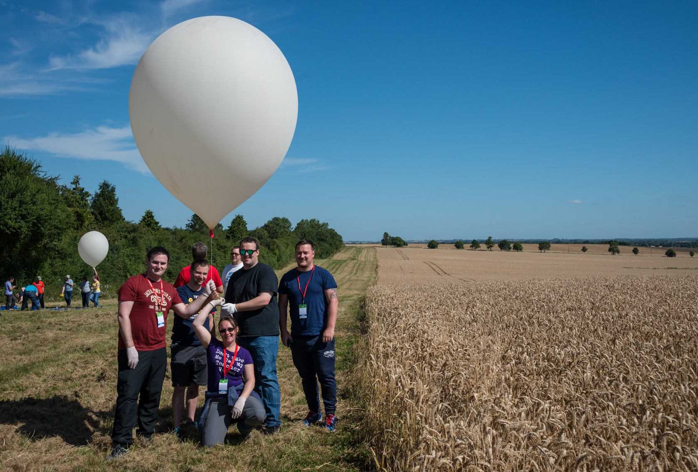

# 2. Build a Team

High Altitude Ballooning is a rewarding but challenging project to undertake with many different aspects to master. Having the right team can be crucial to success, as each team member can take responsibility for key parts of the work. There are a range of roles that others can take on board including students, adults, sponsors and the wider community. Here's our concise guide to team building:

## Students

Your students are ultimately going to be the ones running the flight. It's really helpful to assign roles to each member of the team giving them responsibility and sharing the work. Some roles you might consider:
  - Flight modelers : responsible for running flight predictions for each possible launch site looking for launch windows and potential hazards.
  - Tracker assembly : responsible for building, configuring and troubleshooting the tracker (flight unit)
  - Decoders : these team members have the job of receiving the transmissions from the flight unit and getting them decoded into meaningful data.
  - Online team : this part of the team have the job of getting data and images from the flight unit online. Creating payload and flight documentation to get their paylaod on the map.
  - Payload design : The flight unit needs to be protected during flight, these team members need to design a case to protect and carry their project during the flight.
  - Testing : There are so many parts of the project to test and keep testing that this has to be part of everyone's role.
  - Communications : Your team should share their progress with the world through blogging, social media, school assemblies, local radio.

*Actions :*
Recruit your student team and identify what roles you needs and what skills and interests they have.

## Colleagues

Start by talking to your colleagues and finding out who is interested in assisting at your launches. It's helpful to have people to help with any or all of the following:
  - advise and help others about how a launch works
  - provide support with the different technical challenges of launching the flight
  - help organising other members of your team
  - help provide a cross curricular perspective of the launch and plan activities
  - help with transport, eg the school minibus

*Actions :*
Invite your colleagues to a show and tell session to explain what High Altitude Ballooning is. Use our ["What Is High Altitude Ballooning?"](2/HAB.pdf) slideshow as a starting point.

## Transport
You'll need a safe way of transporting people to and from your launches. Some schools/organisations have their own minibus to use, but you may want to hire a coach or get several volunteer drivers to ferry people around.

*Actions :*
Work out the travel logistics and personnel for getting to a launch site, tracking a payload, retrieving a payload and returning home.

## Wider Community

For a flight to be successfully recovered, you should engage the wider community. If they know about your flight they can help you track your payload's position in the sky in real time. It's a good idea to involve:
  - Your local HAM radio group - tap in to local expertise by finding other local radio enthusiasts. The Radio Society of Great Britain have a useful [Club Finder](https://thersgb.org/services/clubfinder/) on their website. They'll probably be only too happy to offer assistance on the day!
  - The wider HAB community - when you submit your flight documents, the HAB community will also be able to track your flight through [habhub.org](tracker.habhub.org).

*Actions :*
- Visit the use the [tracker](tracker.habhub.org) from the [habhub](habhub.org) website and track a couple of other launches to understand how people monitor flights.
- Find your local, friendly, amateur radio club through the Radio Society of Great Britain's [Club finder](https://thersgb.org/services/clubfinder/).

## Sponsors

Launching a balloon involves a fair amount of kit. You might want to consider getting a local business to sponsor the launches to shift the cost away from your school/organisation.

*Actions :*
Research local businesses you can partner with for launch sponsorship.

## Tech Support

Sometimes you'll need to someone on hand to help troubleshoot particular problems. There are a number of people out there who can help, usually twitter is the best way to make contact.

  - HAB communities such as [#ukhas](https://twitter.com/search?q=%23ukhas&src=typd) or [#skycademy](https://twitter.com/search?q=%23skycademy&src=typd) are great networks to connect with for techical help.
  - [James Robinson](https://twitter.com/legojames) leads leads the Skycademy project for the Raspberry Pi Foundation.
  - [Dave Akerman](https://twitter.com/daveake) has completed many launches and authors the software for the [Pi in the Sky](http://www.pi-in-the-sky.com/) board. You can contact him on Twitter or visit his [website](www.daveakerman.com).
