# 3. Research a launch site

For your HAB launch to be successful you need to locate a suitable launch site (or two) to use on the day of the launch.

An ideal site would have a large open space where the balloon can be safely filled, have easy access from the road so you can transport all the equipment, and provide some shelter from the wind. Additionally you want to ensure you're not going to be launching too close to a tree line or buildings that might snag your payload as it ascends into the air.

Another key point to consider is who owns the land and who do you have to ask permission from before launching. Some sites might also require you to have public liability insurance, if you're taking students along to the launch for instance.

## Run a prediction with sample data

Once you've found a possible site, you're going to need to make a prediction as to your balloon's flight path and probable landing site. There are several variables that can affect your balloon's flight path, such as it's mass, it's ascent rate and it's burst altitude. Of course the variable with the biggest impact is the wind. Luckily there is a tool available on [Habhub](http://predict.habhub.org) for predicting the probable flight path of a balloon.

For this you're going to use some representative data, to give you an indication of the likely flight path, later you will need to use you're own accurate values.

| Data needed  | Example Value | Notes                                                                                                                                                                                           |
|--------------|---------------|-------------------------------------------------------------------------------------------------------------------------------------------------------------------------------------------------|
| Payload Mass | 400g          | This includes the payload box itself plus the parachute and rigging line.                                                                                                                       |
| Ascent Rate  | 5 m/s         | Your payload should ascent around 5-6 m/s, having a more rapid ascent will result in a shorter flight path but use more helium.                                                                |
| Decent Rate  | 5 m/s         | Your descent rate is governed by the mass of the payload and the size of the parachute used, you can calculate this [here](http://www.randomengineering.co.uk/Random_Aerospace/Parachutes.html) |
| Balloon      | Hwoyee-500    | Their are a few different balloon manufacturers, each having slightly different flight profiles, in general though the bigger the balloon to more it can lift |

You can then use the [habhub burst calculator](http://predict.habhub.org/) to estimate the burst altitude of balloon carrying your payload.

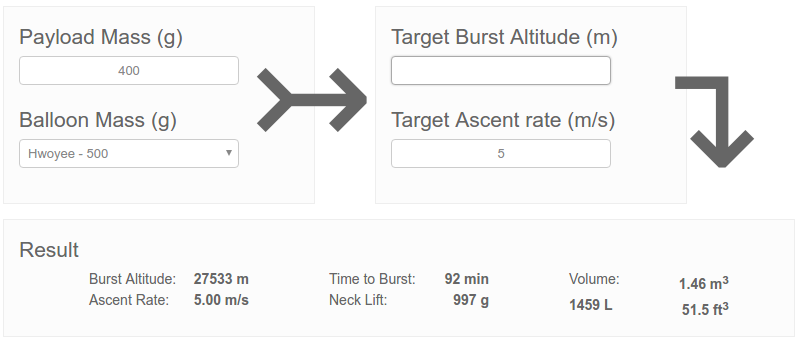

Input the values for mass, ascent rate and balloon type from the table above. Remove the target burst altitude and the calculator will give you some useful data underneath. The most important data is recorded below:

| Data needed    | Example Value      | Notes                                                                                                                                                                          |
|----------------|--------------------|--------------------------------------------------------------------------------------------------------------------------------------------------------------------------------|
| Burst Altitude | 27,553m            | The predicted height at which the balloon will burst. To capture images showing the edge of space and the curvature of the earth you should be aiming for higher than 25,000m. |
| Neck Lift      | 997g               | The amount of lift needed to be generated by the balloon in order to acheive the target ascent rate and burst altitude, this figure is needed for launch day.                  |
| Helium Volume  | 1.46 m2 | The amount of helium needed to generate the required neck lift, this figure is important when sourcing helium to make sure you have enough                                     |

Now that you have all the required data to generate a flight path you can run a prediction for your location.

1. In a browser navigate to [the Habhub predictor](http://predict.habhub.org)
1. You'll be presented with a map that should be centered around you current location.
1. The first thing to do is to find the longitude and latitude of your launch site. Find your launch site on the map by zooming in, and then with your cursor hovering over the launch site, note down the longitude and latitude displayed in the top right corner of the screen. Switching to satelite view can be useful for this.
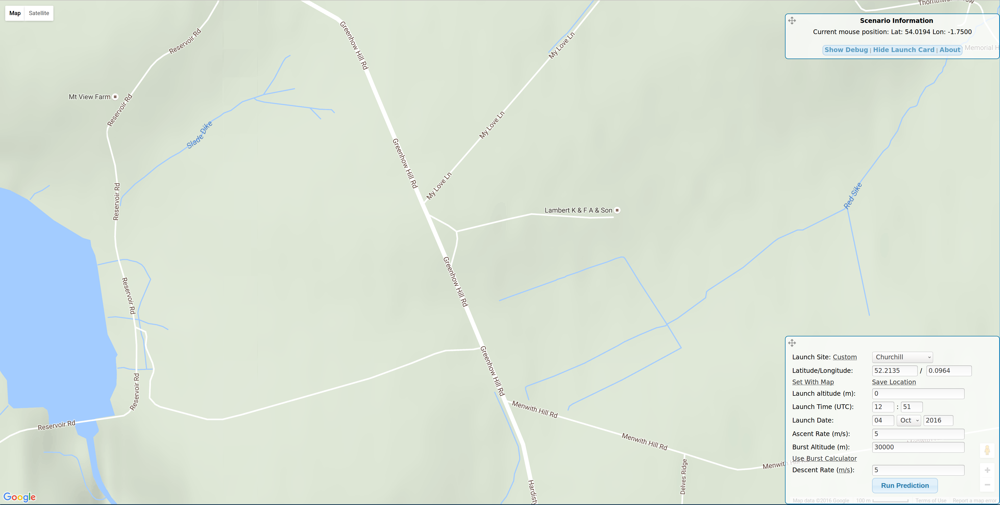
1. Now you can enter those coordinates into the *Prediction* box at bottom right of the screen, and save the location.
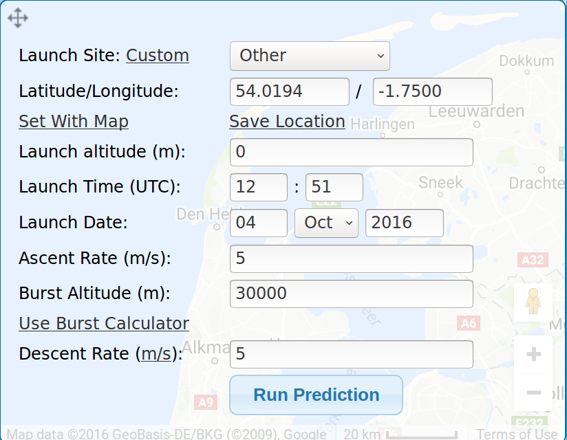
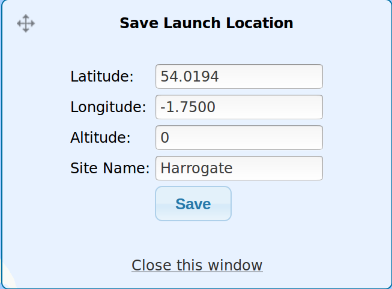
1. If you launch site is considerably above sea level, then it's probably best to add in your altitude. This information is easily obtained from [Free Map Tools](https://www.freemaptools.com/elevation-finder.htm)
1. To begin with, you can choose a time and use some of the values you just calculated:

	| Data | Value |
	| ---- | ----- |
	| Launch Time | `9:00` |
	| Launch Data | `Tomorrow's Date` |
	| Ascent Rate | `5` |
	| Burst Altitude | `27553` |
	| Descent Rate | `5` |

1. With all the data now entered you can click on Run Prediction to see where your balloon will go.

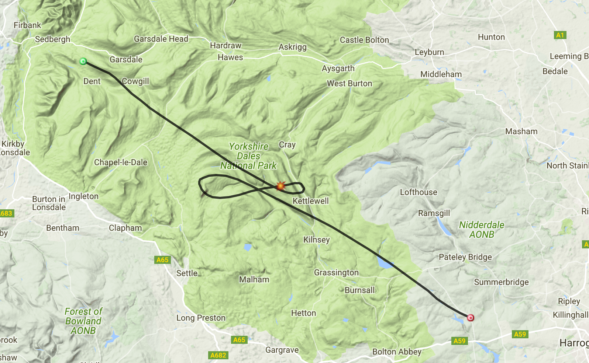

## Identify challenges

The conditions at 9:00am tomorrow might not be quite the same as your actual launch window. The next task is perfect for your team of students to have a go at.
They can tweak various settings in the Habhub predictor to see where the balloon would travel with slightly heavier or lighter payloads, with slightly different ascent and descent rates, and most importantly when launched at different times (within a 180 hour window). Here's an example of how flight plans can change each day, over a 10 day period.

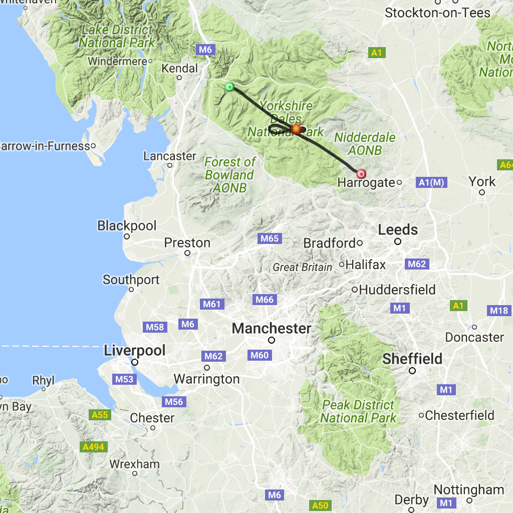

What your students need to be wary of is the balloon passing over, or landing in, any of the following environments.

### Airfields / Airports

Unsurprisingly air traffic controllers don't take kindly to high altitude balloons landing in the middle of runways or interfering with aircraft that are trying to take off.

As part of your launch you will be contacting the Civil Aviation Authority (in the UK), and providing an estimated flight plan, in order to get permission. If you are launching near airfields you may have restrictions on the initial direction of travel or times you can launch. You should also avoid flight paths which take you close to airfields upon landing.

### Bodies of water

If you're proposed launch site is near the coast, then the most obvious large body of water to avoid is the sea. It's very easy for a high altitude balloon to drift a little further than you had planned due to the unpredictability of wind currents and inaccuracies in factors such as burst altitude. If it looks like your payload is likely to land within a few miles of the coast, it is better to be safe than sorry and pick an alternative launch site or time of day.

Small ponds, lakes and rivers are harder to take into account, but if your flight path is such that your payload is likely to come down near a large lake or loch, then it might be best to choose a different launch site.

### Large towns / built up areas

Although the payload is rather small, and unlikely to do any damage to people or objects should it land on them, it is unwise to allow your payload to land in a built up area. A payload coming down on a busy road, could be a danger to traffic for instance. Additionally trying to retrieve your payload when it is lodged on the roof of an apartment building or buried in somebody's back garden may not be easy.

### Border crossings

If you plan to launch close to a national border, then you need to make sure of a couple of things. Firstly, if your balloon could drift into another territory, you have to consider all the laws and permissions you might require to fly in that airspace. Secondly, you had better be sure that you have all the necessary documents and permissions to travel, needed to retrieve your payload from another country.

### Military bases and Government installations.

GCHQ and the MOD don't take kindly to balloons landing in their bases and installations. Try to make sure that your balloon flight avoids military and government installations that may cause issues when it comes to retrieval. Local knowledge is paramount here. If you know an area is surrounded by barbed-wire and patrolled by armed guards, it's probably best avoided by your HAB flight.

## Apply for permission

At least **28 days** before your expected launch, you need to apply for permission from the Civil Aviation Authority (UK only).

You can download the [CAA permission to launch form here](http://stratosvision.com/docs/CAALaunchForm.doc)

### Filling in form

It's always worth ringing the number at the top of the form prior to filling it out, explaining what it is you are planning. This will allow the CAA to advise you on nearby restrictions to flying based on your planned launch site and estimated flight path.

#### Part 1
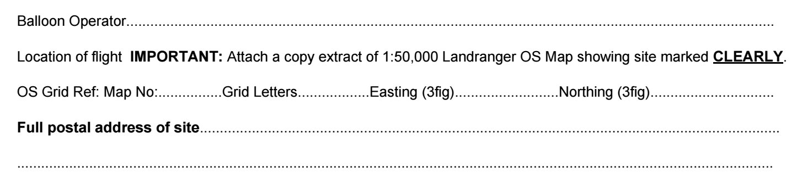
-You are the balloon operator, so your name goes into the first field.
- To get the map grid and Easting/Northing figures, go to the [grid reference finder site](http://www.gridreferencefinder.com/), and type in the Longitude and Latitude of your launch site in the fields on the left, and click on `Go`.

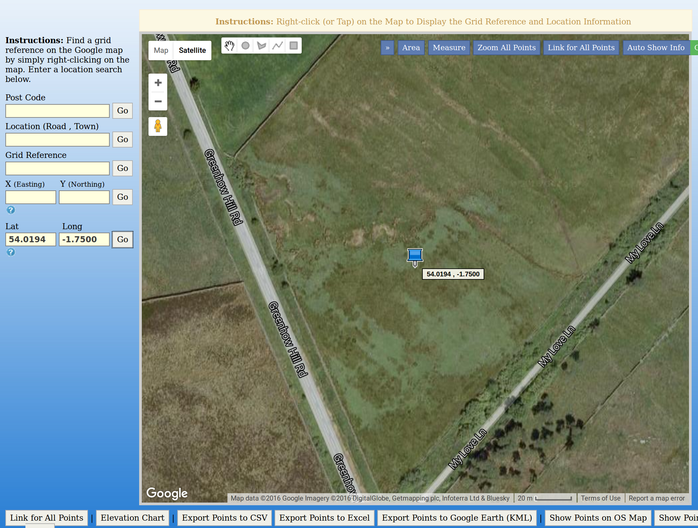

- A pin will appear in the map. Right-clicking on the point where the pin meets the map will drop another pin, with the information you need.

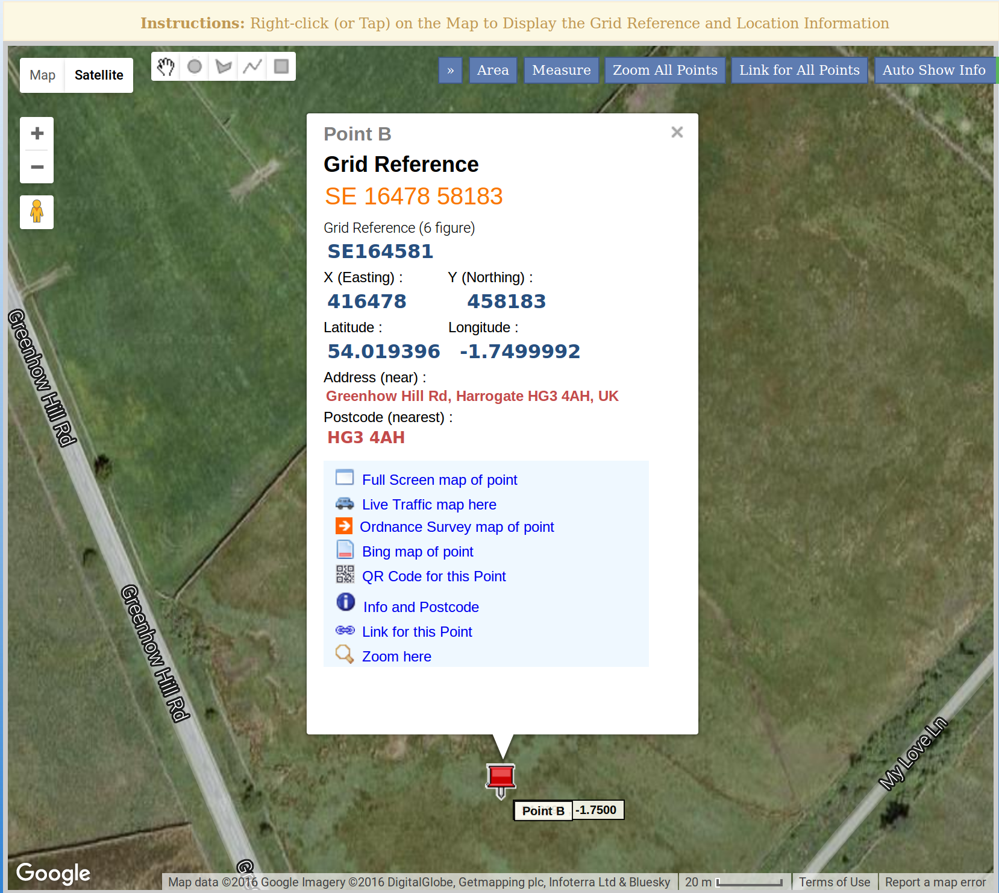

Here you can see that the Grid Reference is `SE 16478 58183`. For the purposes of the form:
- `SE` is the Grid Reference
- `164` is the Easting
- `581` is the Nothing

To find the map number, head on over to the [Ordnance Survey website](https://www.ordnancesurvey.co.uk/shop/maps.html) and type in your grid reference, which will bring up the map you need.

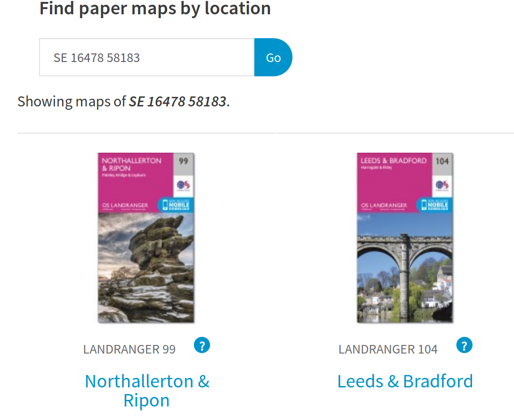

In this case I would choose `99`

Most of the rest of the form should be self-explanatory. Of note though:
1. The `Daily Period` is your launch window - the hours during which you plan to launch
1. The `maximum dimensions` of your balloon will be around 1.5m
1. You'll not be carrying a `radar reflector` as they are not a requirement in the UK
1. The `Instrument suspended from the balloon` is "A small payload with flight computer and camera less than 500g"
1. Lastly, you will have a parachute attached to the payload.

The form also requires you to attach a section of a Landranger OS Map. This can be taken from the site you were on earlier - [grid reference finder site](http://www.gridreferencefinder.com/).

In the pop up box for your pin you should see a link to `Ordnance Survey Map of Point`. Click this and you'll be taken to your OS map, which you can then screen-shot.

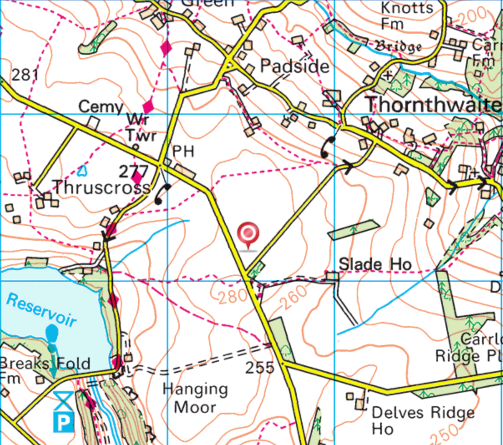

It's also helpful to add a few screen-shots that show an example or ideal flight path of your HAB.

### Notam and restrictions

If your flight is approved, you will receive a Notam (Notice To Airmen), that will also be displayed on the [Notam website](http://notaminfo.com/ukmap). This will detail your flight for pilots in the area, so they are aware of your launch.

If approved, you will receive an exemption form like the one below which details the conditions of your launch, you **must** adhere to these restrictions.

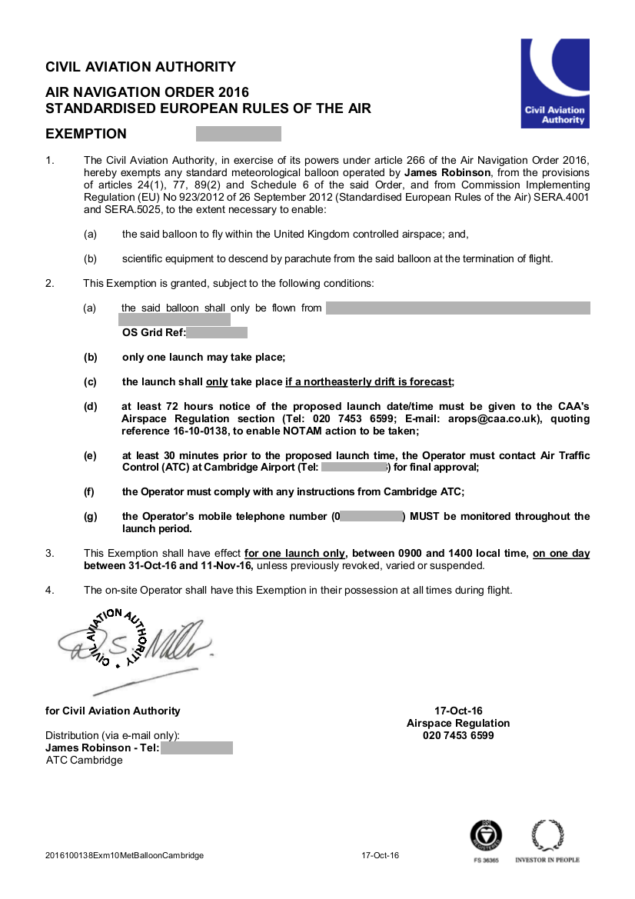

## Find backup sites and repeat

You never know what could go wrong on the day of your launch. Weather conditions could be extremely bad in your area, making the launch from your planned site impossible. There could be road closures, or suddenly the owners of the land might change their mind.

It's always a good idea to have a back up site, a significant distance (>20 miles) from your ideal launch site. Once you have picked an alternate site, all the above steps need repeating for the backup.
