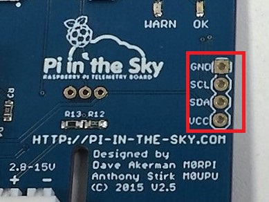
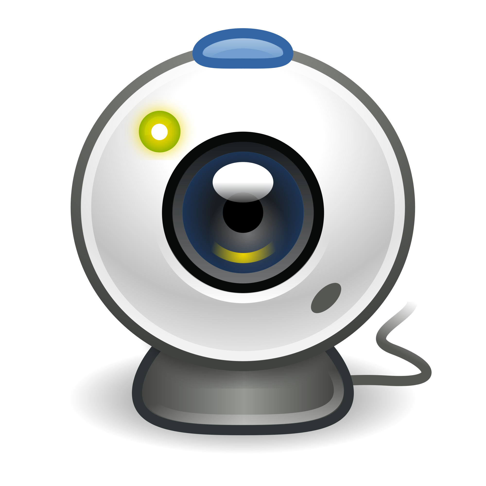

# 4. Build a flight unit

## PITS overview

## Transmission Mechanisms
### RTTY
### LoRa
### APRS

## Assembly

This guide shows you how to assemble a RTTY and LoRa board stack using the [Pi In The Sky kit](https://store.uputronics.com/index.php?route=product/product&path=62&product_id=52). You'll need a crosshead screwdriver for assembly.

When your kit arrives, check you have the components pictured below. You will also get a GPS antenna and battery pack in your kit (not pictured).

**1.** Start by screwing the two stand offs in to the A+ board.

**2.** Push the 10mm GPIO pin extender on to the A+ board's pins.

**3.** Unclip the head of the Picamera and clip the other end in to the A+ board's camera port. We unclip the head so the Picamera ribbon can be threaded through the stacked boards. We can re-attach the head later. The ribbon's blue tab should be facing the USB port.

**4.** Slide the Pi In The Sky board gently down on to the pin extender.

**5.** Pull the Picamera ribbon through the slot, screw the Male to Female standoffs in to the original standoffs, and slide the remaining pin extender on the exposed pins.

**6.** Push the LoRa board gently on to the pin extender and screw it on to the two standoffs. The stack should now be completely flush.

**7.** Thread the Picamera ribbon through the LoRa board and re-attach the Picamera head.

**8.** The final stack. You can now attach the GPS antenna to the left input of your Pi In The Sky board, and the battery pack in to the white input of your Pi In The Sky board.

## Software Installation
Once your tracker is assembled you will need to install and configure the appropriate software to control the unit. To begin with you will need to create a fresh SD card with the "Jessie Lite" image install onto it.

### Create an SD card
  1. First download the "Jessie Lite" [SD card image](https://downloads.raspberrypi.org/raspbian_lite_latest) from the Raspberry Pi Website and save to your computer.
  1. The SD card image is compressed inside a .zip file which needs to be uncompressed to extract to .img file inside.
  1. You should then be able to write your SD card image using a tool called Etcher, which you can download at [etcher.io](https://www.etcher.io/)
  1. Once your card is written you can boot your Raspberry Pi, if this is the first time you have done this take a look at our [quickstart guide](https://www.raspberrypi.org/learning/hardware-guide/quickstart/)
  1. You'll also need to get your Raspberry Pi Connected to the internet which is explained [here](https://www.raspberrypi.org/learning/hardware-guide/networking/)

### Install "Pi in the Sky" Software
You'll need to install the Software that controls the PITS board and all of it's dependencies. There a 2 ways to do this:
  - You can follow the [installation steps](http://www.pi-in-the-sky.com/index.php?id=sd-card-image-from-scratch) found on the "Pi In the Sky" website.
  - We've also created an install [script](rpf.io/hab_install) which simplifies and speeds up the process. To run the script simply type:

  `bash <(wget -O- rpf.io/habinstall)`
  - This will download and run the install script, which will first perform an update before asking you a number of setup questions.
    1. Do you want to enable the Raspberry Pi camera?

      

      *This enables the Raspberry Pi camera in order to capture images during the flight. If you have a camera module and are planning to use it you should answer* **Y**.
    1. Are you using a Lora board?

      

      *If you are using a LORA board to transmit data then say* **Y** *here. This will enable the SPI protocol which is used by the LORA board.*

    1. Do you want to enable the I2C protocol?

      

      *If you are planning to connect [extra sensors](http://www.pi-in-the-sky.com/index.php?id=adding-a-pressure-sensor) to the PITs board via the I2C connectors, then select* **Y** *here. Most people will select* **N**.

    1. Are you you using a USB Webcam?

      

      *There are some USB webcamera that can be connected to the Raspberry Pi and used to capture stills and video. Selecting* **Y** *here installs the fswebcam module. Most people will select* **N**.

  - Once you've answered the questions, the script will then continue to install the software and end with the "Install Complete" message.
  - The next time the Raspberry Pi reboots the PITs software will start and and begin transmitting using the default settings.

## Tracker Configuration
To configure your tracker kit you need to edit a single configuration file using this command:

`sudo nano /boot/pisky.txt`
