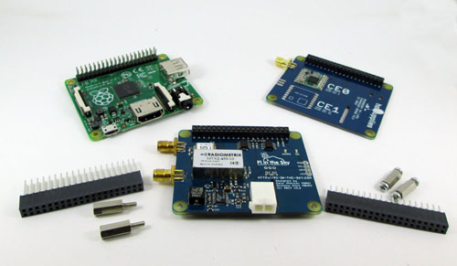
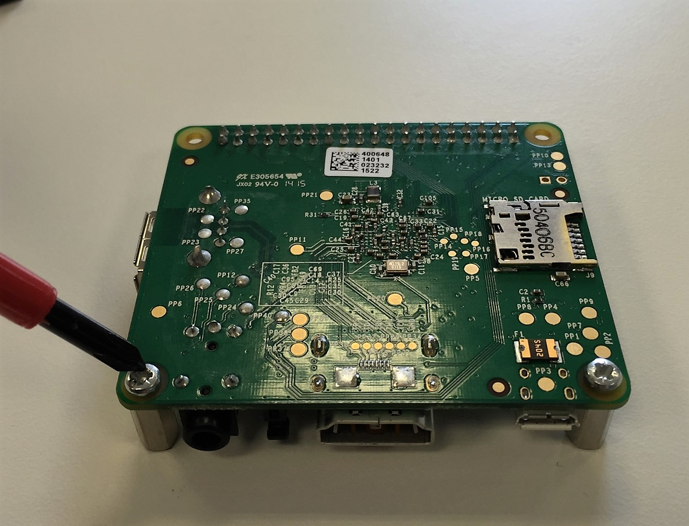
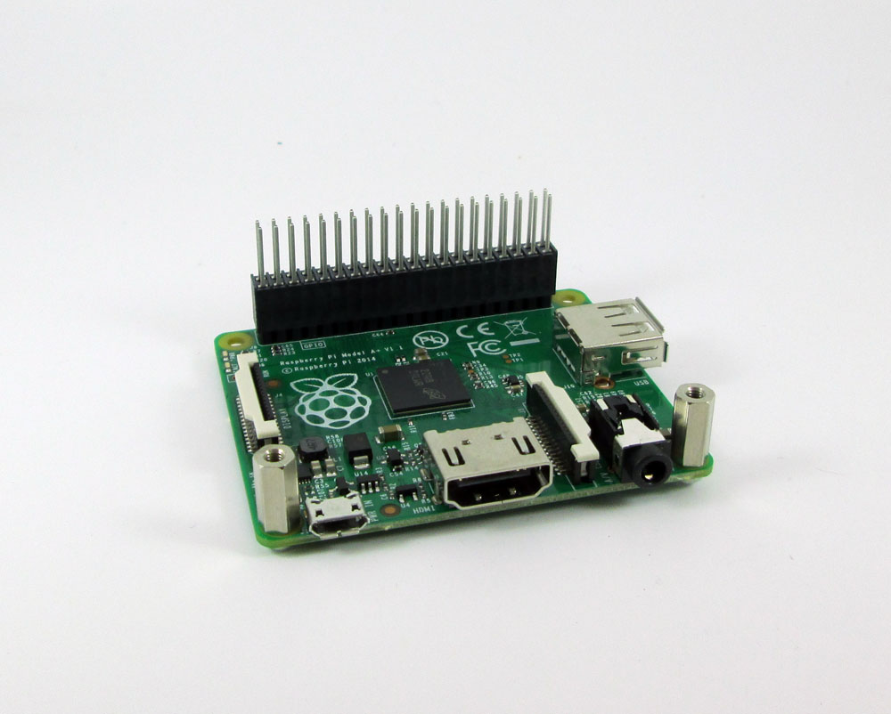

# 4. Build a flight unit

## PITS overview

## Transmission Mechanisms
### RTTY
### LoRa
### Aprs

## Assembly

This guide shows you how to assemble a RTTY and LoRA board stack using the [Pi In The Sky kit](https://store.uputronics.com/index.php?route=product/product&path=62&product_id=52). You'll need a crosshead screwdriver for assembly.

When your kit arrives, check you have the components pictured below: 

**Fig. 1.** Start by screwing 2 stand offs in to the A+ board. 

**Fig. 1.** Push the 10mm GPIO pin extender on to the A+ pins.

## Software Installation

## Tracker Configuration
