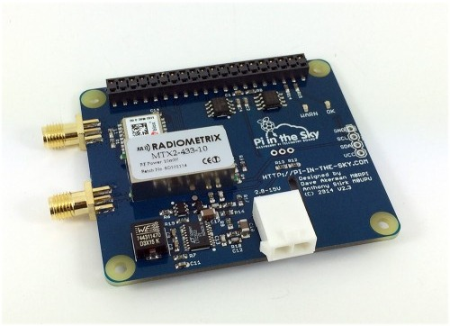
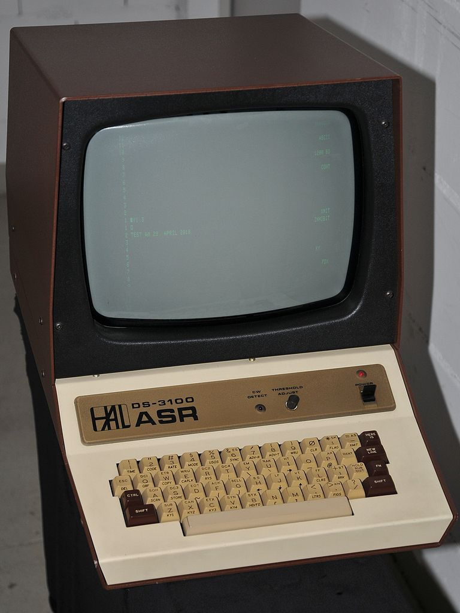
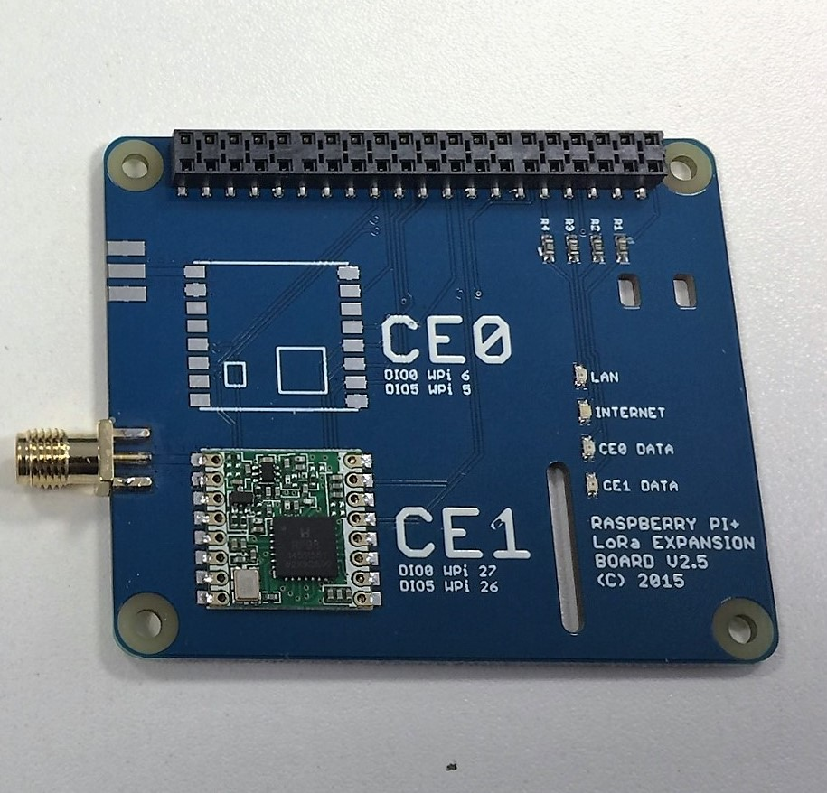
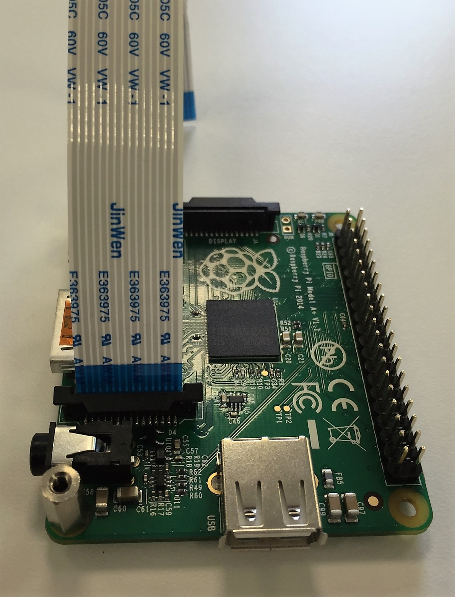
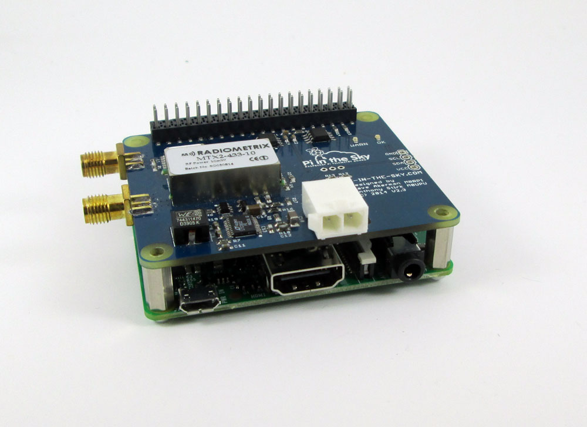
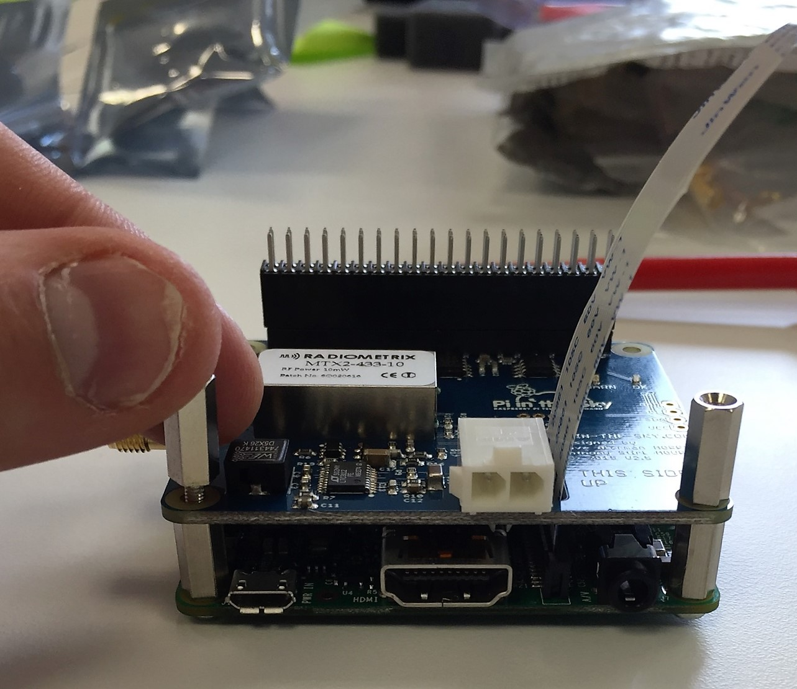
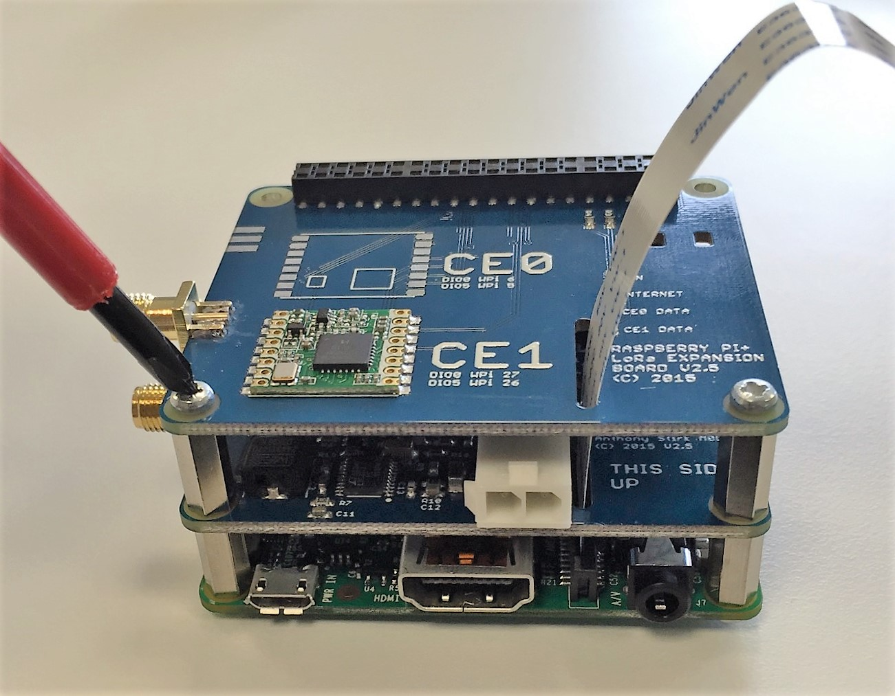
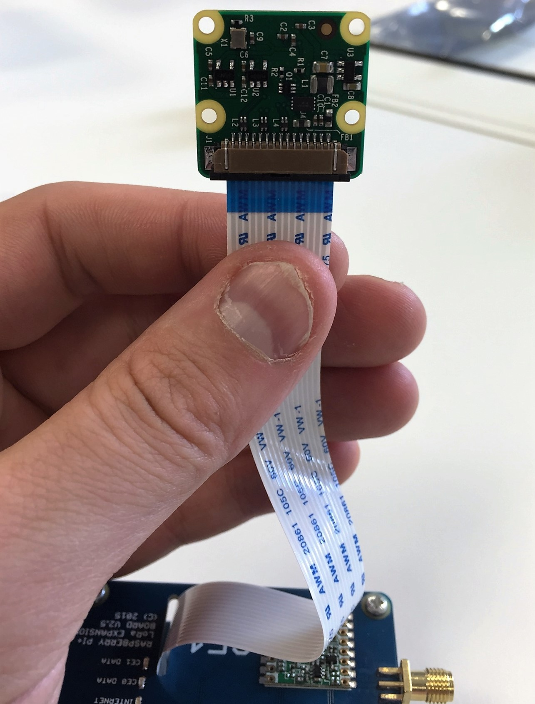
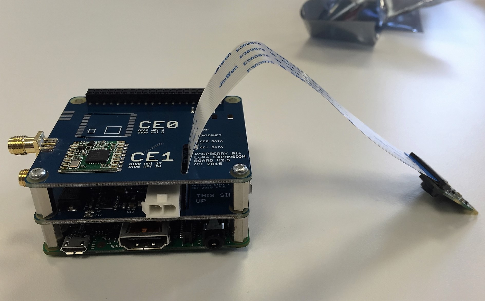

# 4. Build a flight unit

To run a high altitude flight you'll need a flight computer (or tracker) to determine the payloads position and transmit back to earth. Many HAB enthusiasts design and make their own trackers from scratch, but for beginners we'd recommend using an off the shelf unit.

## Pi In The Sky board
The **Pi In the Sky** (PITS) board is an add board for the Raspberry Pi, designed for high altitude ballooning.



The basic board contains a GPS receiver allowing it to accurately detect it's longitude, latitude and altitude. It also contains a UHF radio transmitter, so that it can broadcast that data (and any other data you like) back to the ground.

You can also stack other boards with the PITS board to add other transmission functions to it

## Transmission Mechanisms

The radio transmitter on the PITS boards can broadcast radio waves that can be picked up by a radio receiver on the ground. The transmitter and receiver handle the physics of turning digital signals into radio waves and vice versa. Those digital signals then need to be encoded/decoded by a computer, in our case a Raspberry Pi.

In order to commuicate successfully, both devices need to use the same communication protocol. You can think of a protocol as being similar to a language. For two humans to communicate with each other, they need to be speaking the same language. For the computers to speak to each other via radio, they need to be using the same communication mechanism.

Two popular mechanisms used in High Altitude Ballooning are [Radioteletype](https://en.wikipedia.org/wiki/Radioteletype) (RTTY) and [LoRa](https://www.lora-alliance.org/What-Is-LoRa/Technology), which is type of [Low-Power Wide-Area Network](https://en.wikipedia.org/wiki/LPWAN).

### RTTY

As is, the PITs board can transmit date over radio using the Radioteletype (RTTY) protocol, which was originally used to allow "dumb" electronic teletype machines to be able to communicate with large mainframe computers, meaning computer operators would not have to be in the same room or building as the computer itself. Teletype machines were made obsolete as personal computers became popular.


By <a href="//commons.wikimedia.org/wiki/User:Ulli1105" class="mw-redirect" title="User:Ulli1105">Ulli1105</a> - <span class="int-own-work" lang="en">Own work</span>, <a href="http://creativecommons.org/licenses/by/3.0" title="Creative Commons Attribution 3.0">CC BY 3.0</a>, <a href="https://commons.wikimedia.org/w/index.php?curid=10185467">https://commons.wikimedia.org/w/index.php?curid=10185467</a>

The protocol is designed to allow text to be sent between computers so it is perfect for sending basic data from High Altitude Balloons, such as GPS coordinates. Thanks to some clever software it's also possible to represent images as text and transmit these over RTTY, although it can be slow.
The software used for the RTTY protocol can be tricky to use, with the scope to alter and customise many of the settings. It is also Open Source Software, meaning you are free to have a look at the code and make improvements to it if you like.

### LoRa

An optional board can be stacked with the RTTY board that adds the ability to transmit using LoRa.



LoRa was designed to allow multiple computers to communicate with each other over a Low Power Wide Area Network (LPWAN). It is particularly useful for networking "Internet of Things" (IoT) devices over large distances and with a very low power consumption.

Unlike RTTY, LoRa is proprietary technology, meaning you can't view or modify the source code. It is particularly easy to use however, with minimal configuration required and it is incredibility robust. One of the major advantages of the LoRa protocol is it's higher bandwidth which means it can handle more data, sending text and higher resolution images faster than RTTY.

### RTTY or LoRa

It might seem to make sense to use LoRa boards on their own as they are capable of sending all the data you need from your HAB. However, while LoRa is easier to use and very robust, it has not yet gained the popularity of the RTTY protocol. As on your HAB flight, you'll be getting help from the HAB community, many of whom will also be tracking your balloon, the RTTY protocol is better suited to allowing community members to participate.

So, in order to ensure that you have a successful flight we suggest using both RTTY and LoRa.

## Assembly

This guide shows you how to assemble a RTTY and LoRa board stack using the [Pi In The Sky kit](https://store.uputronics.com/index.php?route=product/product&path=62&product_id=52). You'll need a crosshead screwdriver for assembly. These steps show how to assemble using the A+, which makes it flight ready. However for testing we'd recommend assembling it on a full size Raspberry Pi for setup and testing, giving you extra USB and an ethernet port.

When your kit arrives, check you have the components pictured below. You will also get a GPS antenna and battery pack in your kit (not pictured).


1. Start by screwing the two stand offs in to the A+ board.

  

1. Push the 10mm GPIO pin extender on to the A+ board's pins.

  

1. Unclip the head of the Picamera and clip the other end in to the A+ board's camera port. You unclip the head so the Picamera ribbon can be threaded through the stacked boards. You can re-attach the head later. The ribbon's blue tab should be facing the USB port.

  

1. Slide the Pi In The Sky board gently down on to the pin extender.

  

1. Pull the Picamera ribbon through the slot, screw the Male to Female standoffs in to the original standoffs, and slide the remaining pin extender on the exposed pins.

  

1. Push the LoRa board gently on to the pin extender and screw it on to the two standoffs. The stack should now be completely flush.

  

1. Thread the Picamera ribbon through the LoRa board and re-attach the Picamera head.

  

1. The final stack. You can now attach the GPS antenna to the threaded connector on the left hand input of your Pi In The Sky board, the [prepared pigtail aerials] to the other two connectors, and the battery pack in to the white power connector of your Pi In The Sky board. (You can use the micro USB input of the Pi during testing and just use the battery pack for flight.)

  

## Software Installation
Once your tracker is assembled you will need to install and configure the appropriate software to control the unit. To begin with you will need to create a fresh SD card with the "Jessie Lite" image install onto it.

### Create an SD card
  1. First download the "Jessie Lite" [SD card image](https://downloads.raspberrypi.org/raspbian_lite_latest) from the Raspberry Pi Website and save to your computer.
  1. The SD card image is compressed inside a .zip file which needs to be uncompressed to extract to .img file inside.
  1. You should then be able to write your SD card image using a tool called Etcher, which you can download at [etcher.io](https://www.etcher.io/)
  1. Once your card is written you can boot your Raspberry Pi, if this is the first time you have done this take a look at our [quickstart guide](https://www.raspberrypi.org/learning/hardware-guide/quickstart/)
  1. You'll also need to get your Raspberry Pi Connected to the internet. If you're connecting via an ethernet cable, then you can simply plug it in and everything should work fine. If you are connecing using WiFi (with a Pi3 or using a dongle), then the process is a little more complicated.
  1. First you need to log into the terminal (login=`pi`, password=`raspberry`)
  1. Then type `sudo nano /etc/wpa_supplicant/wpa_supplicant.conf`
  1. You now need to add four lines to the bottom of the file to put in your WiFi details.

  ```bash
  network={
          ssid="Your WiFI Network Name"
		  psk="Your WiFI Network Password"
  }
  ```
  1. Restart your Raspberry Pi and it should automatically connect to the WiFi network.
  1. Once it is connected, you can make sure that it is up-to-date by running the following command in the terminal (ctrl+alt+t)

```bash
  sudo apt-get update && sudo apt-get upgrade
  ```

### Install "Pi in the Sky" Software
You'll need to install the Software that controls the PITS board and all of it's dependencies. There a 2 ways to do this:
  - You can follow the [installation steps](http://www.pi-in-the-sky.com/index.php?id=sd-card-image-from-scratch) found on the "Pi In the Sky" website.
  - We've also created an install [script](rpf.io/habinstall) which simplifies and speeds up the process. To run the script simply type:

  `bash <(wget -O- rpf.io/habinstall)`
  - This will download and run the install script, which will first perform an update before asking you a number of setup questions.
    1. Do you want to enable the Raspberry Pi camera?

          *This enables the Raspberry Pi camera in order to capture images during the flight. If you have a camera module and are planning to use it you should answer* **Y**.
    1. Are you using a Lora board?

          *If you are using a LORA board to transmit data then say* **Y** *here. This will enable the SPI protocol which is used by the LORA board.*

    1. Do you want to enable the I2C protocol?

          *If you are planning to connect [extra sensors](http://www.pi-in-the-sky.com/index.php?id=adding-a-pressure-sensor) to the PITs board via the I2C connectors, then select* **Y** *here. Most people will select* **N**.

    1. Are you you using a USB Webcam?

          *There are some USB webcamera that can be connected to the Raspberry Pi and used to capture stills and video. Selecting* **Y** *here installs the fswebcam module. Most people will select* **N**.

  - Once you've answered the questions, the script will then continue to install the software and end with the "Install Complete" message.
  - The next time the Raspberry Pi reboots the PITs software will start and and begin transmitting using the default settings.

## Tracker Configuration
To configure your tracker kit you need to edit a single configuration file using this command:

`sudo nano /boot/pisky.txt`

1. There are just a few lines to edit here.
1. The first is **payload** - you can change `CHANGEME` to something more appropriate. Any name will do so long as it is under 8 characters and doesn't contain spaces. `RPF-1` for instance. If you are flying your payload in the United States your licensed callsign **must** form part of payload name.
1. The second is the **RTTY frequency**, currently set to `434.250`. It's fine to leave it as this but can be changed to anything between `434.040` and `434.790`
1. Check your LoRa baord to see whether you LoRa chip is in position `CE0` or `CE1`. We've assumed CE1 here but if yours is in CE0 you'll need to change the **LORA Settings** lines to have a `0` instead of a `1` at the end of each parameter name.
1. **LORA_Frequency_1** is currently set to `434.450` which is fine, but again can be set to anything between `434.040` and `434.790`
1. The next is **LORA_payload_1**. Use the same name as you did for RTTY, but add a 2 on the end instead of a 1, e.g. `RPF-2`. Again for the US this must include your callsign.
1. If you're using a Picamera 2, then you'll also want to change **full_high_width** to `3280` and **full_high_height** to `2464`
1. Once that is done hit `ctrl`+`x` and then type `y` to save and close the file.

## Restart you Raspberry Pi
With everything configured, you can now restart your Raspberry Pi. Once it has booted, it should autmoatically start transmitting data over both RTTY and LoRA.

## Boosting the signal
Once you've completed all the above steps your tracker unit should be transmitting. However it will have a minimal range at present as it needs an aerial for each transmitter. A short length (>200mm) of 50ohm coax is suitable, and these are normally provided with the Pi In the Sky kits.

Carefully follow these [instructions](https://ukhas.org.uk/guides:payload_antenna) from UKHAS which show you how to prepare you aerials. **Without this preparation you aerials will be unsuitable for flight**.

Once done, connect you aerials to your tracker as shown.


