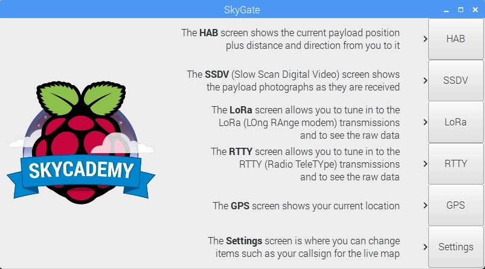
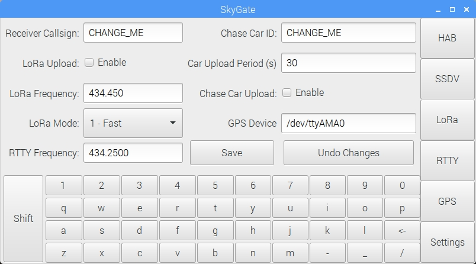
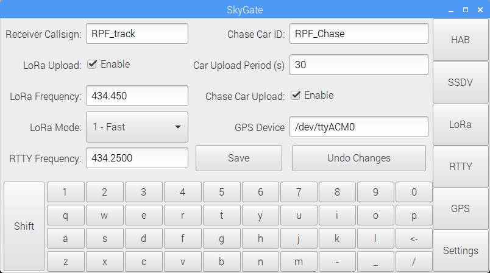
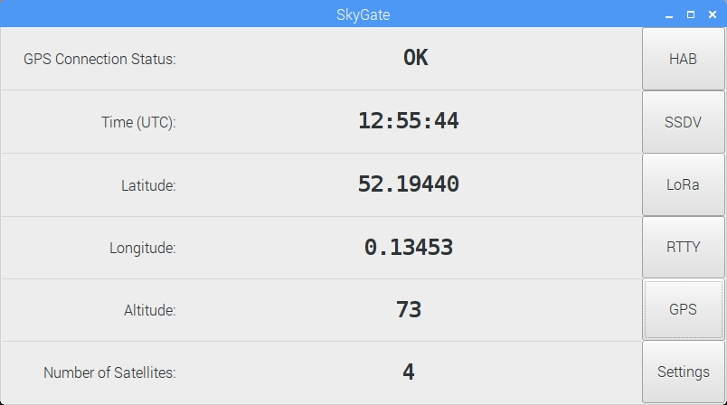
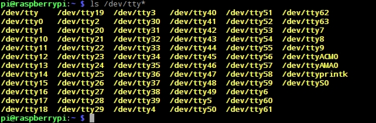
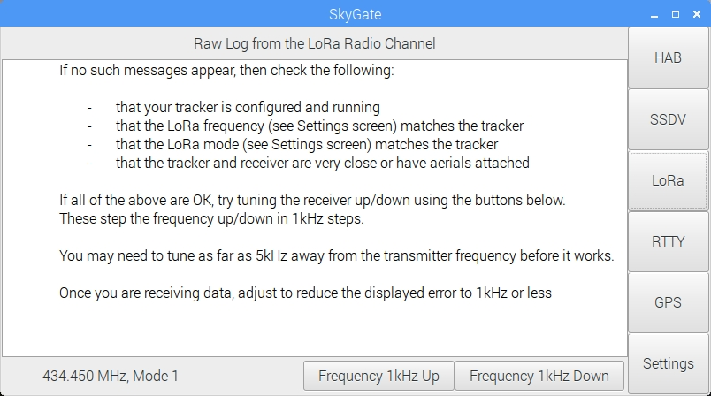

# 5. Test the flight unit

Before you send your balloon up into the stratosphere, you must rigourously test it to ensure you can:
1. Receive the radio signals from the payload.
1. Decode the received data, turning it into a "sentence".
1. Upload your received sentences to the habhub network.

Both RTTY and LoRa are recieved in different ways and in the case of RTTY there are several ways to receive and decode the radio signal.

To make things easier we've developed a piece of software called "skygate" which runs a on a Raspberry Pi and with the right hardware will act as a one stop ballooning tracking tool.


- RTTY data is received by a USB Software Defined Radio (SDR) which feeds an audio signal into the Raspberry Pi 3
- LoRa data is received and decoded by a LoRa board on the Raspberry Pi
- The (optional) USB GPS device enables the tracking unit to determine where it is an give you a direction to the payload.
- Assuming you want to upload your recieved data to the web and have it mapped, you'll need a mobile WiFi hotspot.
- You'll probably want a display unless you're going to run the unit headlessly.
- Power is an important consideration as this device will need to be mobile, a USB battery pack is recommended or a USB car charger may work.
- In order to recieve signals from the stratosphere you'll need an aerial. You could get one each for RTTY & LoRa, or just one which you'd test with each but only use with LoRa during flight.

## Installing Skygate

### Create an SD card
  1. First download the "Jessie" [SD card image](https://downloads.raspberrypi.org/raspbian_latest) from the Raspberry Pi Website and save to your computer.
  1. The SD card image is compressed inside a .zip file which needs to be uncompressed to extract to .img file inside.
  1. You should then be able to write your SD card image using a tool called Etcher, which you can download at [etcher.io](https://www.etcher.io/)
  1. Once your card is written you can boot your Raspberry Pi, if this is the first time you have done this take a look at our [quickstart guide](https://www.raspberrypi.org/learning/hardware-guide/quickstart/)
  1. You'll also need to get your Raspberry Pi Connected to the internet. If you're connecting via an ethernet cable, then you can simply plug it in and everything should work fine. If you are connecing using WiFi then you can click the Wifi icon on the desktop and configure the Wifi network(s) you want to use.


  1. Restart your Raspberry Pi and it should automatically connect to the WiFi network.
  1. Once it is connected, you can make sure that it is up-to-date by running the following command in the terminal (ctrl+alt+t)

```bash
  sudo apt-get update && sudo apt-get upgrade
  ```

### Install Skygate
The skygate software needs to downloaded and installed using the following steps:

  1. Open a new terminal window by pressing `Ctrl` + `Alt` + `T`.
  1. Download the software by typing `git clone https://github.com/raspberrypi/skygate.git`
  1. Enter the install directory `cd install`
  1. Install the Skygate software `./install`, this will install software and set it to autostart on boot.
  1. Restart your Raspberry Pi and on reboot you should find that Skygate has loaded.

  

From here there are a 6 tabs you can visit to setup and use the Skygate software.

  #### Settings

  The settings page allows you to setup the general behaviour of the skygate softwa

  

  | Setting           | Value                                                                                                                                                                                                            |
|-------------------|------------------------------------------------------------------------------------------------------------------------------------------------------------------------------------------------------------------|
| Receiver Callsign | This is the name you want to give to your receiver device, if you upload your received data, this callsign will be associated with each piece of data you send.                                                  |
| LoRa Upload       | If enabled then all LoRa telemetry received by Skygate will be uploaded to the [Habhub](tracker.habhub.org) service for mapping.                                                                                 |
| LoRa Frequency    | This should match the frequency you set for LoRa in your pisky.txt on the tracker unit. In practice due to hardware variations you will likely have to tune a little either side to match the transmitted signal |
| LoRa Mode         | There are a few different modes that LoRa can use, unless you know what you're doing set this to `1`                                                                                                             |
| RTTY Frequency    | This should match the RTTY frequency you set in your pisky.txt file on the tracker unit, once again in practice this may vary.                                                                                   |
| Chase Car ID      | If you're going to use a GPS dongle to track your position you can have the Habhub site show your location with a car icon as you chase the payload. This is the name that will appear next to that icon         |
| Car Upload Period | If you are uploading the chase car position, this determines how often that data is uploaded                                                                                                                     |
| Chase Car Upload  | Enables the uploading of the chase car's position to Habhub                                                                                                                                                      |
| GPS Device        | This identifies the serial device where GPS data will be read, you most likely want this set to `/dev/ttyACM0`. If that doesn't work we'll explain in more detail in the GPS section below.                      |



### GPS

The GPS tab takes data from a connected GPS dongle, parses it and presents the data in a clear form.



For a successful position to be determined the GPS receiver needs to have line of site with 3+ satellites, so if it doesn't work initially move the setup closer to a large window or even take it outside.

If you still get no data then you may need to change the serial device skygate is listening to.
  1. Open up a terminal `Ctrl` + `Alt` + `T` and type `ls /dev/tty*`, this will give you a list of all the serial devices available.

    

  1. Look for any that aren't `tty` followed by a number. In the image above I there's `ttyACM0`,`ttyAMA0` and `ttyprintk`.
  1. Try inserting each of these into the settings tab, saving and rebooting, then wait to see if skygate can find a location.

### LoRa

The LoRa tab is where you can see sentences that are currently being received. When you first start it up you will probably find a screen that looks like this:



1. If you aren't receiving any data then first begin tuning down 1kHz at a time waiting a few seconds between each click.
1. If you haven't received any data after roughly 10 clicks then tune back to where you started and then repeat but tuning upwards.
1. When data is coming through your window should look like this:

  

1. Once you've found the right frequency for your hardware you should add it to the settings page as the new base frequency.

### SSDV

The tracker unit will transit images whilst in flight using *Slow Scan Digital Video* or SSDV for short. The SSDV tab shows a preview of images as there are being recieved.


You can also scroll backwards and forwards through the recieved images using the buttons at either side.

### RTTY

To recieve RTTY data you will need a use a USB SDR using the RTL-FM chipset, such as the ones recommend in the [buying guide](buying_guide.md).

The SDR needs to be connected to the Raspberry Pi before it is booted and the Skygate software loads. As it loads Skygate will form a connection to the SDR device and generate a signal from on the recieving frequency set up earlier.


To decode this signal a seperate piece of software called DL-Fldigi needs to be used. It can be launch in a window using using the **Launch DL-Fldigi** button. This will present a small window containing the software.

  1. To use DL-fldigi to decode the signal you first need to setup the receiving mode. *To do this....*

  

  1. Once these are set you should start to see blue static appearing in what's called the **waterfall** area of the screen.

  

  1. Slowly use the Skygate frequency controls to scan up to 10khz either side of your base frequency. You're looking for a pair of yellow signal lines like this:

  

  1. The spacing of the signal lines is related to the **carrier shift** of the signal. When you move your mouse cursor over the signal you see two vertical lines which should match the distance between the signal lines.

  1. Line up the cursor so that the vertical lines match up with the signal lines and click.

  

  1. Once the cursor is lined up you should start to see data appearing in the Skygate window. After a while you might be able to make out some Sentence data.

  

  1. It may take quite a while for a RTTY sentence to be successfully decoded, you may need to tune the frequency up or down a bit as well as checking the DL-fldigi cursor alignment.  

### HAB

The HAB tab provides an overall of all the data available including:
- The position of the payload
- Your position (or the position of the tracking unit)
- The current time (UTC)
- The direction from your position to the payload.
- **other stuff?**

## Uploading Data

In order to get your payload's postion plotted on a map we first need to ensure that a few options are enabled.

- On the **Settings** tab enable the **Lora Upload** setting, which will upload recieved lora data to the [Habhub](habhub.org) servers.
- To upload the position of the tracking unit enable the **Chase Car Upload** setting.
- *To enable RTTY data to be upload......*

To check that data is being uploaded correctly there are a few websites to visit.

  1. First you can check that your images are being uploaded by visiting [ssdv.habhub.org](ssdv.habhub.org). You should see all the recently recieved images from any payloads currently active.

  

  If you want to see just your uploaded images alone then you can add a `/` and one of your payload names (eg [ssdv.habhub.org/RPF_2](ssdv.habhub.org/RPF_2)).

  

  1. Next if you're uploading you Chase car position, you can visit the habhub flight tracker at [tracker.habhub.org](tracker.habhub.org), if you focus the map on your location you should find a car icon showing you position.

  

  The tracker site is where you'll later find you payload postions being plotted, however there's some extra work to do before that will happen.

  1. You can check that the telemetry sentences you've received are being uploaded by visiting the habhub log at [logtail.habhub.org](logtail.habhub.org)

  

  The logtail will sometimes move past quite fast depending on how many payloads are currently uploading, you can pause the scolling of the log so that you can scan through it.

  What you're looking for is an entry for each payload name you are transmitting, like this:

  

  As you can see the entries curretly report the error `Error message` as the habhub system has no idea how to process the data it's receiving. In order to do that you're going to need to setup a payload document for each, which you'll do in the next step.
