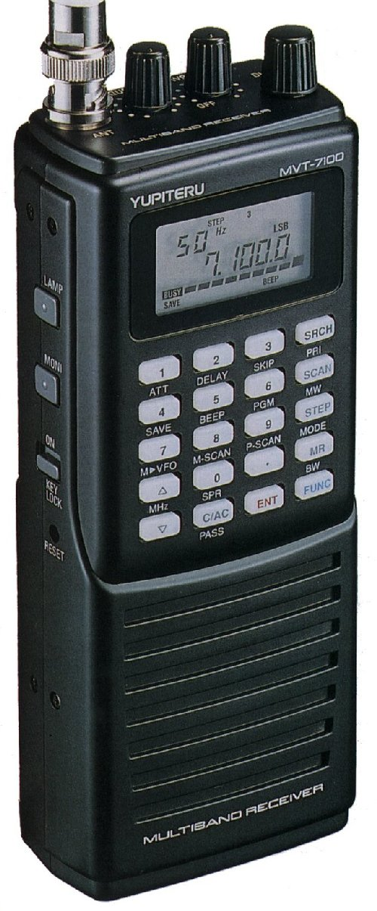

# 5. Test the flight unit

Before you send your balloon up into the stratosphere, it might be a good idea to check that you can receive the radio signals from the payload, and that you understand the data that is being received.

## Recieving Lora

## Recieving RTTY

### Option 1 - Using a handheld radio receiver.
If you have access to a handheld radio receiver like the one shown below, you can use this to receive the RTTY data from the payload.

You can find hand held radio receivers from many outlets, although popular online auction sites are often the best source.

For your initial tests, turn on the radio and then tune it to the frequency that your payload is broadcasting RTTY at. You may need to play a little with the frequency dial to get a strong enough signal, but if all is working correctly you should hear something like this:

<audio controls>
  <source src="5/rtty.mp3" type="audio/mpeg">
Your browser does not support the audio element.
</audio> 

## Decoding RTTY

## Uploading data
