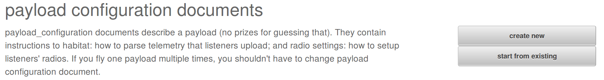
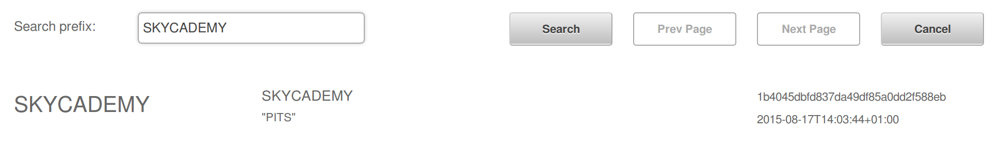
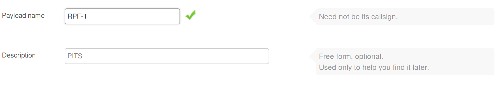

# 6. Getting on the map

## Check data is being uploaded

For others to be able to track you payload, and thereby help with the tracking and recovery, you're going to need to complete a couple on online forms. There are two documents to generate, one for LoRa and one for RTTY.

## Create RTTY payload document

1. Go to the [document generator on the HabHub tracker website](http://habitat.habhub.org/genpayload/).
1. It's easiest to use an existing document to base your new flight document on. So click on the `start from existing` button.

1. A quick search for `SKYCADEMY` will bring up documents we have used before, for Skycademy launches.

1. You'll need to change the payload name to whatever name you chose for RTTY in the `pisky.txt` file you set up earlier.

1. Then you'll need to edit the Radio and telemetry configuration

## Create LoRa payload document

## Build a payload unit

## Testing
