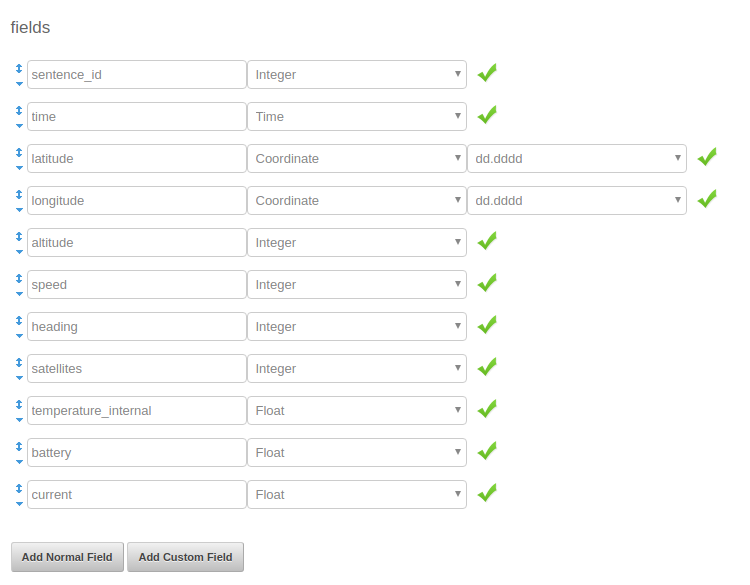

# 6. Getting on the map

## Telemetry sentences

At this stage you should be confident that you tracker is transmitting and that you are able to receive and upload data to the habhub site and see it on the [logtail page](logtail.habhub.org)

Once data is being recieved habhub needs to know how to make sense of (parse) the data, for this it need a **payload document**. The payload doc defines the format of your payload's telemetry sentences.

A telemetry sentence is just a string of data seperated by commas, here's an example of a sentence transmitted by a Pi In The Sky board:

```
$$RPF-A1, 115, 09:47:48, 52.19427, 0.13472, 00033, 0, 0, 10, 30.7, 0.0, 0.000*6961
```

This sentence contains the follow data:

| Data     | Label             | Description                                                                                                                                                                                                                                                                                       |
|----------|-------------------|---------------------------------------------------------------------------------------------------------------------------------------------------------------------------------------------------------------------------------------------------------------------------------------------------|
| RPF-A1   | Payload Name      | The first field provides the payload name, when a sentence is received by habhub it will look for the latest payload doc matching this name.                                                                                                                                                      |
| 115      | Sentence Number   | Each  sentence transmitted is given an incremental number starting from 1, this number indicates which sentence this is.                                                                                                                                                                          |
| 09:47:48 | Transmission Time | Each sentence is given a time stamp, this time is in Universal Coordinated Time (UTC) which often won't match your local time zone.                                                                                                                                                               |
| 52.19427 | Latitude          | This is the tracker's position north(90°) or south(-90°) of the equator(0°).                                                                                                                                                                                                                      |
| 0.13472  | Londitude         |  This is the trackers east/west postion from the Prime Meridian which runs through Grenwich, London. Locations east of 0° are positive values up to +180° and westerly loactions are negative values up to -180°.                                                                                 |
| 00033    | Altitude          | This in the height in metres of the tracker above sea level.                                                                                                                                                                                                                                      |
| 0        | Speed             | This is the current speed (m/s) of the tracker, calculated by comparing the most recent positions and times.                                                                                                                                                                                      |
| 0        | Heading           | This in the current direction of travel, expressed as a bearing from north (0)                                                                                                                                                                                                                    |
| 10       | Satelites         | This is the current number of satelites that the tracker is in contact with, 4 or more are needed in order to get a location in 3 dimensions.                                                                                                                                                     |
| 30.7     | Temperature       | Current internal temperature(°C), as measured by the Pi In The Sky board.                                                                                                                                                                                                                         |
| 0.0      | Battery           | The current battery level in Volts.                                                                                                                                                                                                                                                               |
| 0.000    | Current           | The amount of current by drawn by the Pi In The Sky board.                                                                                                                                                                                                                                        |
| 6961     | Checksum          | The checksum is a value calculated just before the sentence is transmitted and is generated by the first 12 fields. When the sentence is received the same calculation is performed, if the checksum matches then the sentence is correct, if not then it has been corrupted during transmission. |

In order for your tracker to appear on the map you need to create a payload document for each transmission your tracker is broadcasting.


## Create RTTY payload document

1. Go to the [payload document generator](http://habitat.habhub.org/genpayload/) on the HabHub website.
1. Click on the **Create New** button next to the "payload configuration documents" section.

1. Give your payload a unique name, you can use the payload callsign you chose for RTTY in the `pisky.txt` file you set up earlier, but you can choose something else.
1. Enter a short description of your payload in the description box.

1. Then you'll need to edit the Radio and telemetry configuration, click on the add button. You'll then have to detail how you RTTY transmission works, which for standard PITS will be:

| Description | Call it "PITS"                                      |
|-------------|-----------------------------------------------------|
| Frequency   | This should be set to you RTTY frequency eg 434.250 |
| Mode        | USB - stands for Upper Side Bus                     |
| Modulation  | This should be "RTTY"                               |
| Shift(Hz)   | This should be 600                                  |
| Encoding    | This should be set to ASCII-8                       |
| Baud        | Is the speed of data transmission and should be 300 |
| Parity      | This should be set to none                          |
| Stop bits   | This should be 2                                    |

1. You'll then need to add a parser configuration, which defines in the payload doc the structure of the sentences for this payload. Click **copy from another doc** and search for **pi_sky_plus**, selecting any of the matching docs.

1. On the sentence editor window change you callsign to match the RTTY callsign you set in the 'pisky.txt' file.

1. Check that you have these 11 fields listed, if everythin is correct, click save.



1. You'll then return to the payload doc page where you can also click save.

1. You'll be taken to a page telling you your document has been saved and it will have a **Doc ID**. You will need this later, copy the ID string and save somewhere.

## Create LoRa payload document
Creating a payload doc for LoRa is similar to the process for RTTY but sould be quicker.

1. Go to the [payload document generator](http://habitat.habhub.org/genpayload/) on the HabHub website.
1. Click on the **Create New** button next to the "payload configuration documents" section.

1. Give your payload a unique name, you can use the payload callsign you chose for LoRa in the `pisky.txt` file you set up earlier, but you can choose something else.
1. Enter a short description of your payload in the description box.

1. Ignore the Radio and telemetry configuration option.                           |

1. You can then add a parser configuration, which defines in the payload doc the structure of the sentences for this payload. Click **copy from another doc** and search for **pi_sky_plus**, selecting any of the matching docs.

1. On the sentence editor window change you callsign to match the LoRa callsign you set in the 'pisky.txt' file.

1. Check that you have these 11 fields listed, if everythin is correct, click save.


1. You'll then return to the payload doc page where you can also click save.

1. You'll be taken to a page telling you your document has been saved and it will have a **Doc ID**. You will need this later, copy the ID string and save somewhere.

## Checking the map
With these payload docs setup you should be able to get you payload on the map.

1. First visit the [habhub logs](logtail.habhub.org) and look for entries for your paylod callsign(s). Without the payload docs in place you'd see the error "", if they are working you should see this:


1. Check that the uploaded sentence contains a valid latitude and londitude, anything other than 0,0 should be fine. If your payload isn't transmitting a latitude or londitude then it likely doesn't have a GPS fix, try moving it outside.

1. Visit the [habhub tracking](tracker.habhub.org) page and navigate to your location, you should see any of your payloads that are currently being recieved on the map.


If at this point you can't see you payloads on the map, check that both your tracker and receiver are running and that you tracker outside and that your receiver is connected to the internet. For further help  thet easiest way to get support is by [Tweeting](https://twitter.com/intent/tweet?hashtags=skycademy,ukhas) us including the hastags #skycademy and #ukhas.

## Build a payload unit

## Testing
