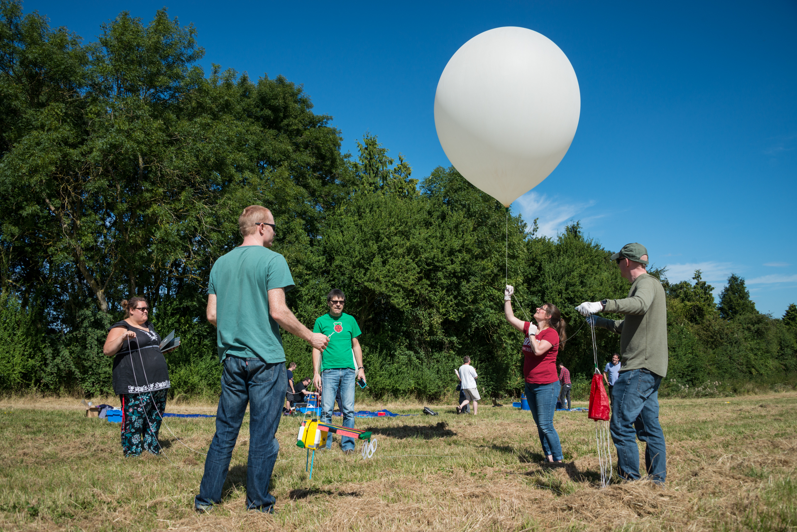
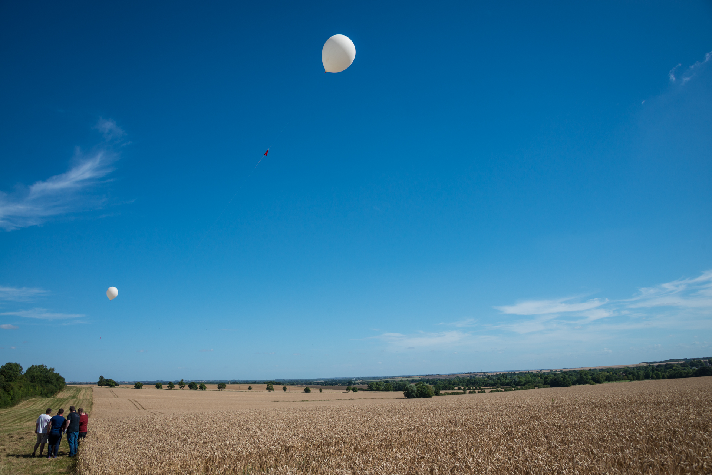
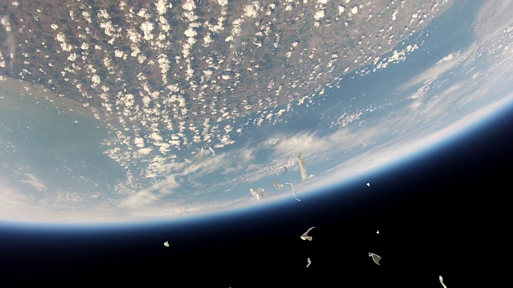

# 9. Launch, Chase and Recover

Here's our walkthrough for anyone wishing to prepare for their launch. More detailed guides for certain procedures can be found in our other guides and are linked to within the text. You can also find a series of excellent articles on the UKHAS wiki.

Please Note: This article assumes you have already successfully assembled and tested your payload and tracking devices. Visit our earlier guides if you need help with assembly.

## One Month Before

1. Order balloons.
2. Get Civil Aviation Authority (CAA) permission to launch, including NOTAM - "a notice filed with an aviation authority to alert aircraft pilots of potential hazards along a flight route or at a location that could affect the safety of the flight."
3. Confirm transport arrangements.
4. Confirm extra staffing needs.
5. Complete an offsite risk assessment.

## One Week Before

1. Order Helium with correct filling adapter, the adapt should look like the images below and is usually referred to as ____________.
2. Repeat your pre-flight calculations to achieve the right ascent rate for your balloon.
3. Make sure students and adult supervisors are clear on their different roles at the launch.
4. Continue to check the flight predictions each day monitoring for any changes. Be prepared to change your plans if needed.

## The Day Before

1. Check the predicted flight path of your launch time and location using the [CUSF Landing Predictor](http://predict.habhub.org/). This will help you work out the best time to launch so that the payload lands safely on land (and not in the sea!)
2. Charge all things that rely on battery power during launch day.
3. Check all your components against your launch inventory list to ensure everything you need is packed for transport.

###To Take On The Day

- CAA Notam
- Telephone Numbers: ATC - local airfields, emergency services, people in chase vehicles
- Payload, batteries (+ spares) RADAR reflector, parachute
- Balloons, Cable ties, Cord, Duct Tape
- Helium, regulator, filling system
- Tools inc. spanners, snips
- Scales, weights/a plastic milk bottle full of water
- Radio System: Receiver, Yagi, Stand, PC, Software, Audio-lead, Batteries (+ spares)
- Ancillary stuff like: Table, Chairs, Sun/Rain shade
- Recovery: GPS, long telescopic pole (for retrieval from trees), string, Two way radio (intra recovery team comms)
- Other: Boots, Wet weather clothes, Sun hats, Suncream, Drinking water, Food, Toilet roll

## On Arrival At The Launch Site

1. Check the predicted flight path again using the [CUSF Landing Predictor](http://predict.habhub.org/). Weather in the UK is so varied, it's always best to check on the day!
2. Contact your local Air Traffic Control (ATC) to confirm your launch window.
3. Lay out tarpaulin and secure with tent pegs.
4. Power up your payload and check it's posting images to [ssdv.habhub.org](http://ssdv.habhub.org/).
5. Power up your tracking equipment and test that you are receiving a clear signal from the payload. **should link to section 5: Test The Flight Unit once written**
6. Secure your payload in it's polystyrene capsule with lots of gaffa tape. Make sure the camera module is also securely fastened in position.
7. Attach lengths of nylon cord to your payload and attach the parachute.
8. Put on your latex gloves. Lay your balloon out carefully on the tarpaulin and inspect for wear and tear.
9. Use cable ties and duct tape to fasten the neck and mouth of the balloon round the balloon-to-gas cylinder adapter. Attach the weighed out water in a bottle to the balloon using nylon cord.
10. Turn on the gas to begin filling the balloon. Continue to fill until the balloon gently rises with the water bottle attached.
11. Seal the balloon in the method described on [UKHAS.org.uk](https://ukhas.org.uk/guides:sealing_the_balloon).
12. Remove the water bottle and attach the payload to the balloon using gaffa tape.
13. Do a quick test for wind direction by throwing some grass in the air. Check that the balloon isn't going to fly in to a hazard such as trees, pylons, etc.
14. Do a final check to make sure you are still getting a signal.
15. Let go of the balloon to launch!
16. In addition to the above, there is also a list of [common launch mistakes] (https://ukhas.org.uk/guides:things_not_to_do) you'll want to consider as your prepare.

## Chasing and Payload Recovery

It usually takes around 2-2.5 hours for a balloon to launch, reach maximum height, burst, descend slowly via parachute, and land. You therefore have a decent amount of time to track and retrieve your payload. It's worth reading the UKHAS guides to a [successful payload recovery](https://ukhas.org.uk/guides:chasing_your_flight) and ['What Not To Do'](https://ukhas.org.uk/guides:how_to_lose_your_flight) before you launch to make sure you stand the best chance of getting it back.

While we can't tell you what to do in every eventuality, we thought it might be beneficial for you to read a couple of blog posts about recent chases we have done and what we encountered.
- In this [first blog post](http://www.daveakerman.com/?p=1943), Dave Akerman's payload sets a new altitude record and lands in a field of sheep.
- In this [second blog post](https://www.raspberrypi.org/blog/skycademy-2016/), the balloon bursts early and lands the payload in a military firing range!

Good luck with your flight and let us know how it goes!
