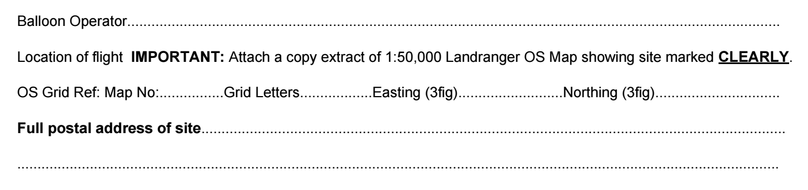
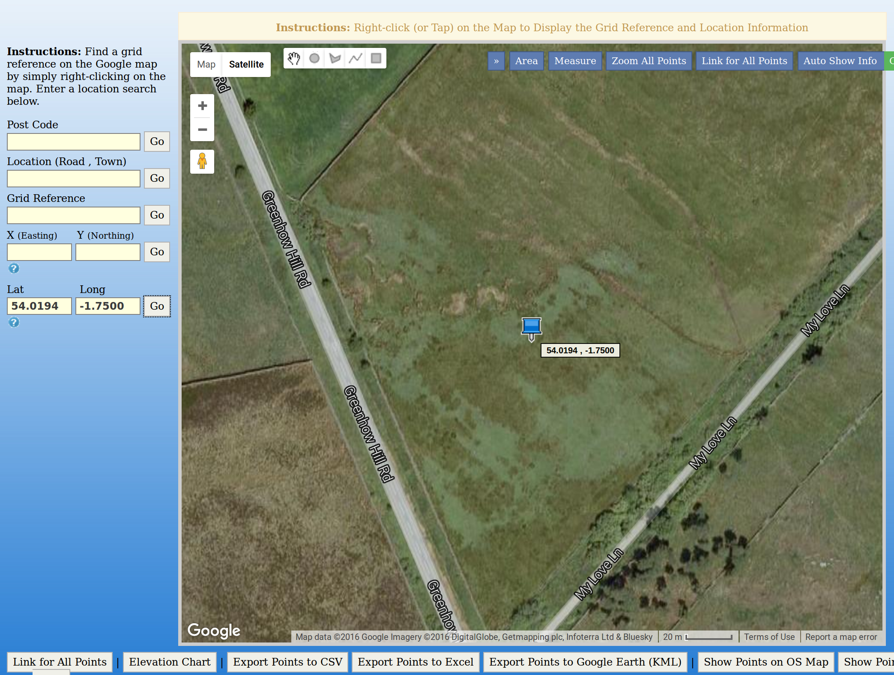
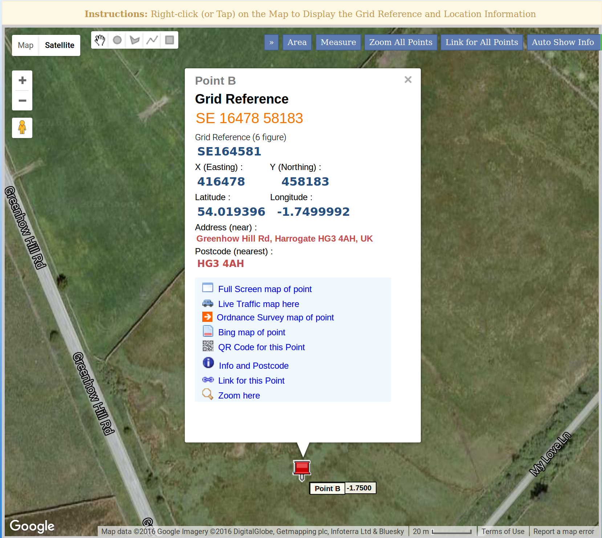
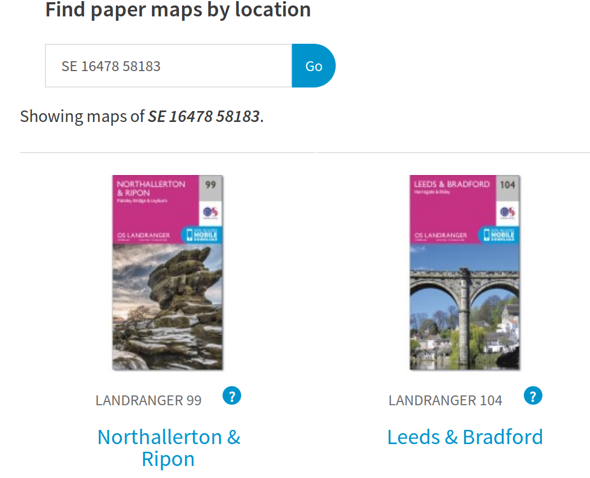
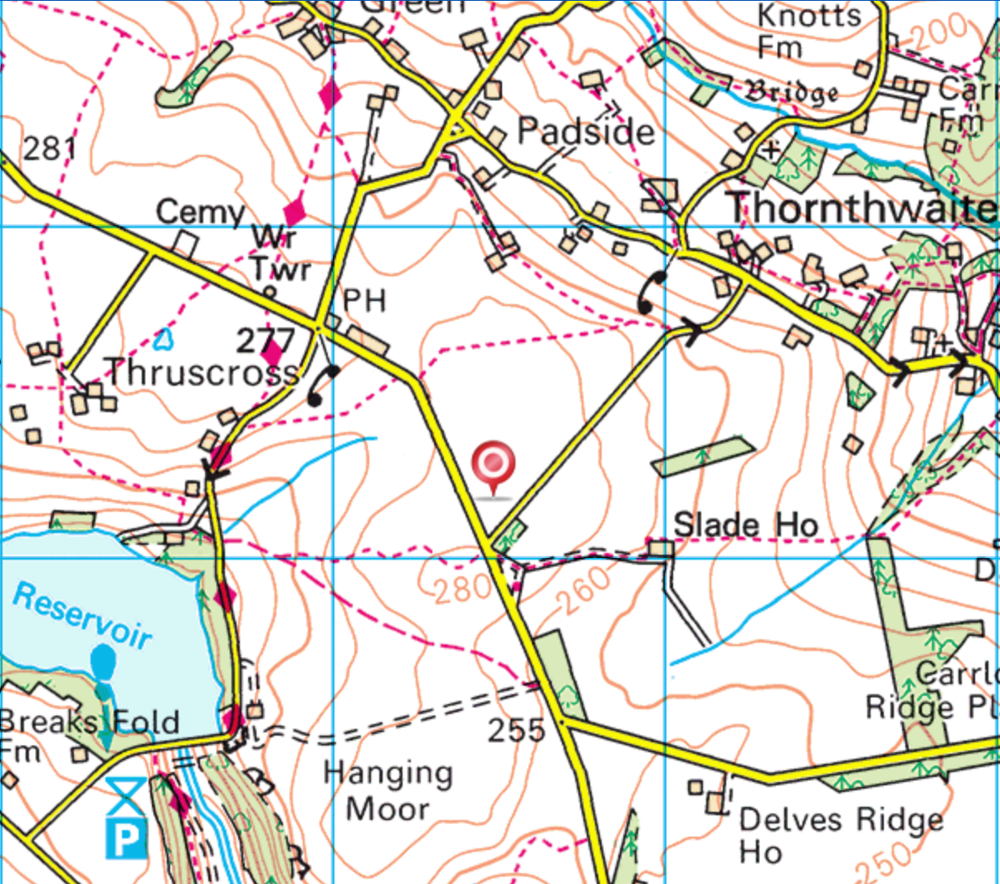

# Getting CAA approval (UK Only)

You can download the [CAA permission to launch form here](http://stratosvision.com/docs/CAALaunchForm.doc)

## Filling in form

It's always worth ringing the number at the top of the form prior to filling it out, explaining what it is you are planning. This will allow the CAA to advise you on nearby restrictions to flying based on your planned launch site and estimated flight path.

- You are the balloon operator, so your name goes into the first field.
- To get the map grid and Easting/Northing figures, go to the [grid reference finder site](http://www.gridreferencefinder.com/), and type in the Longitude and Latitude of your launch site in the fields on the left, and click on `Go`.

- A pin will appear in the map. Right-clicking on the point where the pin meets the map will drop another pin, with the information you need.

Here you can see that the Grid Reference is `SE 16478 58183`. For the purposes of the form:
- `SE` is the Grid Reference
- `164` is the Easting
- `581` is the Nothing

To find the map number, head on over to the [Ordnance Survey website](https://www.ordnancesurvey.co.uk/shop/maps.html) and type in your grid reference, which will bring up the map you need.

In this case I would choose `99`

Most of the rest of the form should be self-explanatory. Of note though:
1. The `Daily Period` is your launch window - the hours during which you plan to launch
1. The `maximum dimensions` of your balloon will be around 1.5m
1. You'll not be carrying a `radar reflector` as they are not a requirement in the UK
1. The `Instrument suspended from the balloon` is "A small payload with flight computer and camera less than 500g"
1. Lastly, you will have a parachute attached to the payload.

The form also requires you to attach a section of a Landranger OS Map. This can be taken from the site you were on earlier - [grid reference finder site](http://www.gridreferencefinder.com/).

In the pop up box for your pin you should see a link to `Ordnance Survey Map of Point`. Click this and you'll be taken to your OS map, which you can then screen-shot.

It's also helpful to add a few screen-shots that show an example or ideal flight path of your HAB.

## Approval process
- Once complete send the form to the email address included **at least 28 days** before the launch.
- Most forms are reviewed in the days leading up to the launch and so you may not get much feedback until then.
- Contact the CAA early on with the 28 day window and discuss the launch site with them, find out if their are likely to be any restricitions on your flight. These might include the time of day you can launch, the direction the balloon must travel in etc. If the restrictions are too limiting then consider looking for another site.

## Notam and restrictions
If approved, you will receive an exemption form like the one below which details the conditions of your launch, you **must** adhere to these restrictions.

If your flight is approved, you will receive a Notam (Notice To Airmen), that will also be displayed on the [Notam website](http://notaminfo.com/ukmap). This will detail your flight for pilots in the area, so they are aware of your launch.

**Reminder : You must not launch without permission from the CAA, or outside of any approved flight window.**
